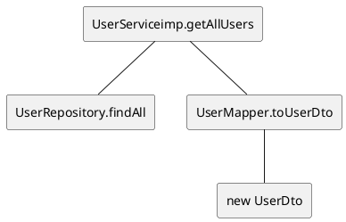
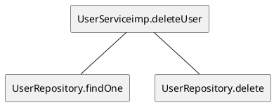

# Dependency Trees

## Class it.polito.ezgas.service.impl.UserServiceimpl

### method *getUserById*


### method *saveUser*


### method *getAllUsers*



### method *deleteUSer*



### method *login*

```plantuml
@startuml

@enduml
```

### method *increaseReputation*

```plantuml
@startuml

@enduml
```

### method *decreaseReputation*

```plantuml
@startuml

@enduml
```

## Class it.polito.ezgas.service.impl.GasStationServiceimpl

### method *getGasStationById*

```plantuml
@startuml

@enduml
```

### method *saveGasStation*

```plantuml
@startuml

@enduml
```

### method *getAllGasStations*

```plantuml
@startuml

@enduml
```

### method *getGasStationsByProximity*

```plantuml
@startuml

@enduml
```

### method *getGasStationsWithCoordinates*

```plantuml
@startuml

@enduml
```

### method *getGasStationsWithoutCoordinates*

```plantuml
@startuml

@enduml
```

### method *setReport*

```plantuml
@startuml

@enduml
```

### method *getGasStationByCarSharing*

```plantuml
@startuml

@enduml
```

## Class it.polito.ezgas.controller.UserController

### method *getUserById*

```plantuml
@startuml

@enduml
```

### method *getAllUsers*

```plantuml
@startuml

@enduml
```

### method *saveUser*

```plantuml
@startuml

@enduml
```

### method *deleteUser*

```plantuml
@startuml

@enduml
```

### method *increaseUserReputation*

```plantuml
@startuml

@enduml
```

### method *decreaseUserReputation*

```plantuml
@startuml

@enduml
```

### method *login*

```plantuml
@startuml

@enduml
```

## Class it.polito.ezgas.controller.GasStationController

### method *getGasStationById*

```plantuml
@startuml

@enduml
```

### method *getAllGasStations*

```plantuml
@startuml

@enduml
```

### method *saveGasStation*

```plantuml
@startuml

@enduml
```

### method *deleteUser*

```plantuml
@startuml

@enduml
```

### method *getGasStationsByGasolineType*

```plantuml
@startuml

@enduml
```

### method *getGasStationsByProximity*

```plantuml
@startuml

@enduml
```

### method *getGasStationsWithCoordinates*

```plantuml
@startuml

@enduml
```

### method *setGasStationReport*

```plantuml
@startuml

@enduml
```

## Class it.polito.ezgas.scheduling.ScheduledTasks

### method *scheduleUpdateGasStationReportDependability*

```plantuml
@startuml

@enduml
```