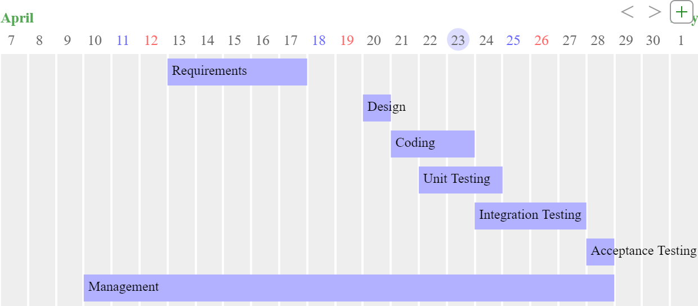

# Project Estimation  

Authors: Alessandro Borione, Giacomo Garaccione, Corrado Vecchio, Marco Vinai

Date: 25/04/2020

Version: 1.0

# Contents

- [Project Estimation](#project-estimation)
- [Contents](#contents)
- [Estimation approach](#estimation-approach)
- [Estimate by product decomposition](#estimate-by-product-decomposition)
- [Estimate by activity decomposition](#estimate-by-activity-decomposition)
    - [Gantt Chart](#gantt-chart)
    

# Estimation approach

# Estimate by product decomposition

|                                                                                                         | Estimate |
| ------------------------------------------------------------------------------------------------------- | -------- |
| NC =  Estimated number of classes to be developed                                                       | 13       |
| A = Estimated average size per class, in LOC                                                            | 140      |
| S = Estimated size of project, in LOC (= NC * A)                                                        | 1820     |
| E = Estimated effort, in person hours (here use productivity 10 LOC per person hour)                    | 182      |
| C = Estimated cost, in euro (here use 1 person hour cost = 30 euro)                                     | 5460     |
| Estimated calendar time, in calendar weeks (Assume team of 4 people, 8 hours per day, 5 days per week ) | 2        |

Since work can't be parallelized for each activity, the estimated calendar time is not the direct division (5460/(4x8x5)).
The resulting estimated calendar time is not feasible for our situation, since we won't work full time on this project. Having worked together for both requirement document and GUI prototype, the number of hours spent in those activities is very high due to factor 4.
In any case, for a full-time working team, that estimate could be quite accurate, as shown in the Gantt Chart.

# Estimate by activity decomposition

| Activity name       | Estimated effort (person hours) |
| ------------------- | ------------------------------- |
| Requirements        | 64                              |
| Design              | 8                               |
| Coding              | 45                              |
| Unit Testing        | 40                              |
| Integration Testing | 10                              |
| Acceptance Testing  | 5                               |
| Management          | 10                              |

### Gantt Chart

Saturdays and Sundays appear in the chart but there is no work done on these days.