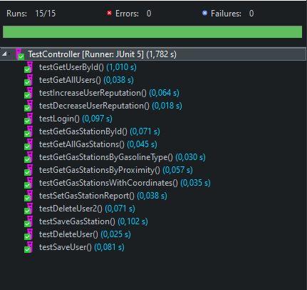

# GUI  Testing Documentation 

Authors: Alessandro Borione, Giacomo Garaccione, Corrado Vecchio, Marco Vinai

Date: 29/05/2020

Version: 1.0

# GUI testing

## Coverage of Scenarios and FR

|  Use case ID   | Functional Requirements covered | GUI Test(s) |
| :------------: | :-----------------------------: | :---------: |
|       1        |             FR 1.1              | GUITestUC1  |
|       2        |             FR 1.1              | GUITestUC2  |
|       3        |             FR 1.2              | GUITestUC3  |
|       4        |             FR 3.1              | GUITestUC4  |
|       5        |             FR 3.1              | GUITestUC5  |
|       6        |             FR 3.2              | GUITestUC6  |
|       7        |             FR 5.1              | GUITestUC7  |
|       8        |         FR 4.1, FR 4.2          | GUITestUC8  |
|       9        |             FR 5.2              | GUITestUC9  |
|       10       |             FR 5.3              | GUITestUC10 |
| (Scenario)10.2 |             FR 5.3              | GUITestS102 |
|   -- CR4 --    |             FR 5.1              | GUITestCR4  |

# REST  API  Testing

## Coverage of Controller methods

| class.method name                                    | Functional Requirements covered |          REST  API Test(s)          |
| ---------------------------------------------------- | :-----------------------------: | :---------------------------------: |
| UserController.getUserById()                         |              FR1.4              |          testGetUserById()          |
| UserController.getAllUsers()                         |              FR1.3              |           testGaaUsers()            |
| UserController.saveUser()                            |              FR1.1              |           testSaveUSer()            |
| UserController.deleteUser()                          |              FR1.2              |          testDeleteUser()           |
| UserController.increaseUserReputation()              |              FR5.3              |    testIncreaseUserReputation()     |
| UserController.decreaseUserReputation()              |              FR5.3              |    testDecreaseUserReputation()     |
| UserController.login()                               |               FR2               |             testLogin()             |
|                                                      |                                 |                                     |
| GasStationController.getGasStationById()             |                -                |       testGetGasStationById()       |
| GasStationController.getAllGasStations()             |              FR3.3              |       testGetAllGasStations()       |
| GasStationController.saveGasStation()                |              FR3.1              |        testSaveGasStation()         |
| GasStationController.deleteGasStation()              |              FR3.2              |       testDeleteGasStation()        |
| GasStationController.getGasStationsByGasolineType()  |              FR4.5              | testGetGasStationsByGasolineType()  |
| GasStationController.getGasStationsByProximity()     |              FR4.2              |   testGetGasStationsByProximity()   |
| GasStationController.getGasStationsWithCoordinates() |              FR4.1              | testGetGasStationsWtihCoordinates() |
| GasStationController.setGasStationReport()           |              FR5.1              |      testSetGasStationReport()      |

All tests are meant to be run using the provided db. After the execution, changes are not rolled back, so the db should be discarded.

## API Test result

