# Integration and API Test Documentation

Authors: Alessandro Borione, Giacomo Garaccione, Corrado Vecchio, Marco Vinai

Date: 21/05/2020

Version: 0.1

# Contents

- [Dependency graph](#dependency-graph)

- [Integration and API Test Documentation](#integration-and-api-test-documentation)
- [Contents](#contents)
- [Dependency graph](#dependency-graph)
- [Integration approach](#integration-approach)
- [Tests](#tests)
  - [Step 1](#step-1)
  - [Step 2](#step-2)
  - [Step 3 - API Tests](#step-3---api-tests)
- [Scenarios](#scenarios)
  - [Scenario UC4.2](#scenario-uc42)
  - [Scenario UC4.3](#scenario-uc43)
  - [Scenario UC5.2](#scenario-uc52)
  - [Scenario UC6.2](#scenario-uc62)
  - [Scenario UC7.2](#scenario-uc72)
  - [Scenario UC7.3](#scenario-uc73)
  - [Scenario UC7.4](#scenario-uc74)
  - [Scenario UC8.2](#scenario-uc82)
  - [Scenario UC8.3](#scenario-uc83)
- [Coverage of Scenarios and FR](#coverage-of-scenarios-and-fr)
- [Coverage of Non Functional Requirements](#coverage-of-non-functional-requirements)
    - 

- [Tests](#tests)

- [Scenarios](#scenarios)

- [Coverage of scenarios and FR](#scenario-coverage)
- [Coverage of non-functional requirements](#nfr-coverage)

# Dependency graph 

```plantuml
@startuml


agent GasStationServiceimpl.getGasStationById as getGasStationById
agent GasStationServiceimpl.saveGasStation as saveGasStation
agent GasStationServiceimpl.getAllGasStations as getAllGasStations
agent GasStationServiceimpl.deleteGasStation as deleteGasStation
agent GasStationServiceimpl.getGasStationsByGasolineType as getGasStationsByGasolineType
agent GasStationServiceimpl.getGasStationsByProximity as getGasStationsByProximity
agent GasStationServiceimpl.getGasStationsWithCoordinates as getGasStationsWithCoordinates
agent GasStationServiceimpl.getGasStationsWithoutCoordinates as getGasStationsWithoutCoordinates
agent GasStationServiceimpl.setReport as setReport
agent GasStationServiceimpl.getGasStationByCarSharing as getGasStationByCarSharing
agent GasStationServiceimpl.isGasolineTypeValid as isGasolineTypeValid
agent GasStationServiceimpl.mapGasolineTypeToMethod as mapGasolineTypeToMethod
agent GasStationServiceimpl.priceCorrect as priceCorrect
agent GasStationServiceimpl.geoPointDistance as geoPointDistance
agent GasStationServiceimpl.latLonCorrect as latLonCorrect
agent GasStationRepository.findOne as findOneGs
agent GasStationRepository.findAll as findAllGs
agent GasStationRepository.findByCarSharing as findByCarSharing
agent GasStationRepository.findByAddress as findByAddress
agent GasStationRepository.save as saveGs
agent GasStationMapper.toGSDto as toGSDto
agent GasStationMapper.toGS as toGS
agent GasStation.getGasStationId as getGasStationId
agent GasStation.setGasStationId as setGasStationId
agent GasStation.getGasStationName as getGasStationName
agent GasStation.setGasStationName as setGasStationName
agent GasStation.getGasStationAddress as getGasStationAddress
agent GasStation.setGasStationAddress as setGasStationAddress
agent GasStation.getReportDependability as getReportDependability
agent GasStation.setReportDependability as setReportDependability
agent GasStation.getReportUser as getReportUser
agent GasStation.setReportUser as setReportUser
agent GasStation.getReportTimestamp as getReportTimestamp
agent GasStation.setReportTimestamp as setReportTimestamp
agent GasStation.getHasDiesel as getHasDiesel
agent GasStation.setHasDiesel as setHasDiesel
agent GasStation.getHasSuper as getHasSuper
agent GasStation.setHasSuper as setHasSuper
agent GasStation.getHasSuperPlus as getHasSuperPlus
agent GasStation.setHasSuperPlus as setHasSuperPlus
agent GasStation.getHasGas as getHasGas
agent GasStation.setHasGas as setHasGas
agent GasStation.getHasMethane as getHasMethane
agent GasStation.setHasMethane as setHasMethane
agent GasStation.getLat as getLat
agent GasStation.setLat as setLat
agent GasStation.getLon as getLon
agent GasStation.setLon as setLon
agent GasStation.getDieselPrice as getDieselPrice
agent GasStation.setDieselPrice as setDieselPrice
agent GasStation.getSuperPrice as getSuperPrice
agent GasStation.setSuperPrice as setSuperPrice
agent GasStation.getSuperPlusPrice as getSuperPlusPrice
agent GasStation.setSuperPlusPrice as setSuperPlusPrice
agent GasStation.getGasPrice as getGasPrice
agent GasStation.setGasPrice as setGasPrice
agent GasStation.getMethanePrice as getMethanePrice
agent GasStation.setMethanePrice as setMethanePrice
agent GasStation.getUser as getUser
agent GasStation.setUser as setUser
agent GasStation.getCarSharing as getCarSharing
agent GasStation.setCarSharing as setCarSharing
agent GasStationDto.getGasStationId as getGasStationIdDto
agent GasStationDto.setGasStationId as setGasStationIdDto
agent GasStationDto.getGasStationName as getGasStationNameDto
agent GasStationDto.setGasStationName as setGasStationNameDto
agent GasStationDto.getGasStationAddress as getGasStationAddressDto
agent GasStationDto.setGasStationAddress as setGasStationAddressDto
agent GasStationDto.getReportDependability as getReportDependabilityDto
agent GasStationDto.setReportDependability as setReportDependabilityDto
agent GasStationDto.getReportUser as getReportUserDto
agent GasStationDto.setReportUser as setReportUserDto
agent GasStationDto.getReportTimestamp as getReportTimestampDto
agent GasStationDto.setReportTimestamp as setReportTimestampDto
agent GasStationDto.getHasDiesel as getHasDieselDto
agent GasStationDto.setHasDiesel as setHasDieselDto
agent GasStationDto.getHasSuper as getHasSuperDto
agent GasStationDto.setHasSuper as setHasSuperDto
agent GasStationDto.getHasSuperPlus as getHasSuperPlusDto
agent GasStationDto.setHasSuperPlus as setHasSuperPlusDto
agent GasStationDto.getHasGas as getHasGasDto
agent GasStationDto.setHasGas as setHasGasDto
agent GasStationDto.getHasMethane as getHasMethaneDto
agent GasStationDto.setHasMethane as setHasMethaneDto
agent GasStationDto.getLat as getLatDto
agent GasStationDto.setLat as setLatDto
agent GasStationDto.getLon as getLonDto
agent GasStationDto.setLon as setLonDto
agent GasStationDto.getDieselPrice as getDieselPriceDto
agent GasStationDto.setDieselPrice as setDieselPriceDto
agent GasStationDto.getSuperPrice as getSuperPriceDto
agent GasStationDto.setSuperPrice as setSuperPriceDto
agent GasStationDto.getSuperPlusPrice as getSuperPlusPriceDto
agent GasStationDto.setSuperPlusPrice as setSuperPlusPriceDto
agent GasStationDto.getGasPrice as getGasPriceDto
agent GasStationDto.setGasPrice as setGasPriceDto
agent GasStationDto.getMethanePrice as getMethanePriceDto
agent GasStationDto.setMethanePrice as setMethanePriceDto
agent GasStationDto.getUser as getUserDto
agent GasStationDto.setUser as setUserDto
agent GasStationDto.getCarSharing as getCarSharingDto
agent GasStationDto.setCarSharing as setCarSharingDto



toGS -- setGasStationId
toGS -- setGasStationName
toGS -- setGasStationAddress
toGS -- setCarSharing
toGS -- setHasDiesel
toGS -- setHasGas
toGS -- setHasMethane
toGS -- setHasSuper
toGS -- setHasSuperPlus
toGS -- setDieselPrice
toGS -- setGasPrice
toGS -- setMethanePrice
toGS -- setSuperPrice
toGS -- setSuperPlusPrice
toGS -- setLat
toGS -- setLon
toGS -- setReportUser
toGS -- setReportTimestamp
toGS -- setReportDependability
toGS -- getGasStationIdDto
toGS -- getGasStationNameDto
toGS -- getGasStationAddressDto
toGS -- getCarSharingDto
toGS -- getHasDieselDto
toGS -- getHasGasDto
toGS -- getHasMethaneDto
toGS -- getHasSuperDto
toGS -- getHasSuperPlusDto
toGS -- getDieselPriceDto
toGS -- getGasPriceDto
toGS -- getMethanePriceDto
toGS -- getSuperPriceDto
toGS -- getSuperPlusPriceDto
toGS -- getLatDto
toGS -- getLonDto
toGS -- getReportUserDto
toGS -- getReportTimestampDto
toGS -- getReportDependabilityDto
toGSDto -- setGasStationIdDto
toGSDto -- setGasStationNameDto
toGSDto -- setGasStationAddressDto
toGSDto -- setCarSharingDto
toGSDto -- setHasDieselDto
toGSDto -- setHasGasDto
toGSDto -- setHasMethaneDto
toGSDto -- setHasSuperDto
toGSDto -- setHasSuperPlusDto
toGSDto -- setDieselPriceDto
toGSDto -- setGasPriceDto
toGSDto -- setMethanePriceDto
toGSDto -- setSuperPriceDto
toGSDto -- setSuperPlusPriceDto
toGSDto -- setLatDto
toGSDto -- setLonDto
toGSDto -- setReportUserDto
toGSDto -- setReportTimestampDto
toGSDto -- setReportDependabilityDto
toGSDto -- getGasStationId
toGSDto -- getGasStationName
toGSDto -- getGasStationAddress
toGSDto -- getCarSharing
toGSDto -- getHasDiesel
toGSDto -- getHasGas
toGSDto -- getHasMethane
toGSDto -- getHasSuper
toGSDto -- getHasSuperPlus
toGSDto -- getDieselPrice
toGSDto -- getGasPrice
toGSDto -- getMethanePrice
toGSDto -- getSuperPrice
toGSDto -- getSuperPlusPrice
toGSDto -- getLat
toGSDto -- getLon
toGSDto -- getReportUser
toGSDto -- getReportTimestamp
toGSDto -- getReportDependability
getGasStationById -- findOneGs
getGasStationById -- toGSDto
saveGasStation -- setDieselPriceDto
saveGasStation -- setGasPriceDto
saveGasStation -- setMethanePriceDto
saveGasStation -- setSuperPriceDto
saveGasStation -- setSuperPlusPriceDto
saveGasStation -- priceCorrect
saveGasStation -- latLonCorrect
saveGasStation -- saveGs
saveGasStation -- toGSDto
saveGasStation -- findByAddress
getAllGasStations -- findAllGs
getAllGasStations -- toGSDto
deleteGasStation -- findOneGs
getGasStationsByGasolineType -- isGasolineTypeValid
getGasStationsByGasolineType -- findAllGs
getGasStationsByGasolineType -- toGSDto
getGasStationsByGasolineType -- mapGasolineTypeToMethod
getGasStationsByProximity -- latLonCorrect
getGasStationsByProximity -- findAllGs
getGasStationsByProximity -- geoPointDistance
getGasStationsByProximity -- toGSDto
getGasStationsWithCoordinates -- latLonCorrect
getGasStationsWithCoordinates -- getGasStationsWithoutCoordinates
getGasStationsWithCoordinates -- geoPointDistance
getGasStationsWithoutCoordinates -- isGasolineTypeValid
getGasStationsWithoutCoordinates -- getGasStationByCarSharing
getGasStationsWithoutCoordinates -- mapGasolineTypeToMethod
setReport -- findOneGs
/' setReport -- findOneU '/
setReport -- priceCorrect
setReport -- toGSDto
setReport -- setDieselPrice
setReport -- setGasPrice
setReport -- setMethanePrice
setReport -- setSuperPrice
setReport -- setSuperPlusPrice
setReport -- setReportUser
setReport -- setUser
/'setReport -- user.getUserId'/
setReport -- setReportTimestamp
setReport -- setReportDependability
/'setReport -- user.getReputation'/
setReport -- saveGs
getGasStationByCarSharing -- getAllGasStations
getGasStationByCarSharing -- findByCarSharing
getGasStationByCarSharing -- toGSDto
mapGasolineTypeToMethod -- getHasDieselDto
mapGasolineTypeToMethod -- getHasGasDto
mapGasolineTypeToMethod -- getHasMethaneDto
mapGasolineTypeToMethod -- getHasSuperDto
mapGasolineTypeToMethod -- getHasSuperPlusDto
priceCorrect -- getHasDieselDto
priceCorrect -- getDieselPriceDto
priceCorrect -- getHasGasDto
priceCorrect -- getGasPriceDto
priceCorrect -- getHasMethaneDto
priceCorrect -- getMethanePriceDto
priceCorrect -- getHasSuperDto
priceCorrect -- getSuperPriceDto
priceCorrect -- getHasSuperPlusDto
priceCorrect -- getSuperPlusPriceDto

@enduml
```

     
# Integration approach

    <Write here the integration sequence you adopted, in general terms (top down, bottom up, mixed) and as sequence
    (ex: step1: class A, step 2: class A+B, step 3: class A+B+C, etc)> 
    <The last integration step corresponds to API testing at level of Service package>
    <Tests at level of Controller package will be done later>

#  Tests

## Step 1
|     Classes      | JUnit test cases |
| :--------------: | :--------------: |
| GasStationMapper |    testToGS1     |
|                  |    testToGS2     |
|                  |    testToGS3     |
|                  |    testToGS4     |
|                  |    testToGS5     |
|                  |    testToGS6     |
|                  |   testToGSDto1   |
|                  |   testToGSDto2   |
|                  |   testToGSDto3   |
|                  |   testToGSDto4   |

## Step 2
|                 Classes                  |           JUnit test cases            |
| :--------------------------------------: | :-----------------------------------: |
| GasStationServiceimpl + GasStationMapper |        testGetGasStationById1         |
|                                          |        testGetGasStationById2         |
|                                          |          testSaveGasStation1          |
|                                          |          testSaveGasStation2          |
|                                          |          testSaveGasStation3          |
|                                          |          testSaveGasStation4          |
|                                          |          testSaveGasStation5          |
|                                          |          testSaveGasStation6          |
|                                          |        testGetAllGasStations1         |
|                                          |        testGetAllGasStations2         |
|                                          |         testDeleteGasStation1         |
|                                          |         testDeleteGasStation2         |
|                                          |   testGetGasStationsByGasolineType1   |
|                                          |   testGetGasStationsByGasolineType2   |
|                                          |   testGetGasStationsByGasolineType3   |
|                                          |      testGasStationsByProximity1      |
|                                          |      testGasStationsByProximity2      |
|                                          |      testGasStationsByProximity3      |
|                                          |      testGasStationsByProximity4      |
|                                          |    testGetGasStationsByCarSharing1    |
|                                          |    testGetGasStationsByCarSharing2    |
|                                          |    testGetGasStationsByCarSharing3    |
|                                          |  testGetGasStationsWithCoordinates1   |
|                                          |  testGetGasStationsWithCoordinates2   |
|                                          |  testGetGasStationsWithCoordinates3   |
|                                          |  testGetGasStationsWithCoordinates4   |
|                                          |  testGetGasStationsWithCoordinates5   |
|                                          |  testGetGasStationsWithCoordinates6   |
|                                          | testGetGasStationsWithoutCoordinates1 |
|                                          | testGetGasStationsWithoutCoordinates2 |
|                                          | testGetGasStationsWithoutCoordinates3 |
|                                          |     testMapGasolineTypeToMethod1      |
|                                          |           testPriceCorrect1           |
|                                          |           testPriceCorrect2           |

## Step 3 - API Tests

|                 Classes                 | JUnit test cases |
| :-------------------------------------: | :--------------: |
| UserServiceimpl + GasStationServiceimpl |  testSetReport1  |
|                                         |  testSetReport2  |
|                                         |  testSetReport3  |
|                                         |  testSetReport4  |

# Scenarios

## Scenario UC4.2

| Scenario       | Create new Gas Station with already registered address |
| -------------- | :----------------------------------------------------: |
| Precondition   |              Gas Station G does not exist              |
|                | Gas Station with the same address as G already exists  |
| Post condition |                  Error message shown                   |
| Step#          |                      Description                       |
| 1              |    Admin inserts all of G's information and submits    |
| 2              |  System checks if address is already in the database   |
| 3              |                  System returns null                   |

## Scenario UC4.3

| Scenario       |     Create new Gas Station with impossible coordinates     |
| -------------- | :--------------------------------------------------------: |
| Precondition   |                Gas Station G does not exist                |
|                | Gas Station's latitude and/or longitude are not acceptable |
| Post condition |                      Exception shown                       |
| Step#          |                        Description                         |
| 1              |      Admin inserts all of G's information and submits      |
| 2              |  System checks if latitude and longitude are both correct  |
| 3              |                 System throws an exception                 |

## Scenario UC5.2

| Scenario       |               Update existing Gas Station with already existing address               |
| -------------- | :-----------------------------------------------------------------------------------: |
| Precondition   |                         Gas Station G exists in the database                          |
|                | Admin wants to update the gas station's address with one used for another Gas Station |
| Post condition |                                    Exception shown                                    |
| Step#          |                                      Description                                      |
| 1              |                   Admin inserts all of G's information and submits                    |
| 2              |                  System checks if address chosen is not already used                  |
| 3              |                              System throws an exception                               |

## Scenario UC6.2

| Scenario       | Delete a Gas Station that does not exist |
| -------------- | :--------------------------------------: |
| Precondition   |       Gas Station G does not exist       |
| Post condition |             Raise exception              |
| Notes          |             Fail-safe check              |

## Scenario UC7.2

| Scenario       | Report on a Gas Station that does not exist |
| -------------- | :-----------------------------------------: |
| Precondition   |        Gas Station G does not exist         |
| Post condition |               Raise exception               |
| Notes          |               Fail-safe check               |

## Scenario UC7.3

| Scenario       | Report on a Gas Station done by a User that does not exist |
| -------------- | :--------------------------------------------------------: |
| Precondition   |                   User U does not exist                    |
| Post condition |                      Raise exception                       |
| Notes          |                      Fail-safe check                       |

## Scenario UC7.4

| Scenario       | Report on a Gas Station with non existing fuel types reported |
| -------------- | :-----------------------------------------------------------: |
| Precondition   |      One/some of the reported fuel types does not exist       |
| Post condition |                        Raise exception                        |
| Notes          |                        Fail-safe check                        |

## Scenario UC8.2

| Scenario       |  User U inserts incorrect coordinates   |
| -------------- | :-------------------------------------: |
| Precondition   | Latitude and/or longitude are incorrect |
| Post condition |             Raise exception             |
| Notes          |             Fail-safe check             |

## Scenario UC8.3

| Scenario       | User U inserts an invalid fuel type for a given gas station |
| -------------- | :---------------------------------------------------------: |
| Precondition   |        Fuel type does not exist for the gas station         |
| Post condition |                       Raise exception                       |
| Notes          |                       Fail-safe check                       |

# Coverage of Scenarios and FR

| Scenario ID | Functional Requirements covered |             JUnit  Test(s)              |
| :---------: | :-----------------------------: | :-------------------------------------: |
|    UC4.2    |              FR3.1              |          testSaveGasStation4()          |
|    UC4.3    |              FR3.1              |          testSaveGasStation2()          |
|             |                                 |          testSaveGasStation3()          |
|    UC5.2    |             FR 3.1              |          testSaveGasStation4()          |
|    UC6.2    |              FR3.2              |         testDeleteGasStation2()         |
|    UC7.2    |              FR5.3              |            testSetReport2()             |
|    UC7.3    |              FR5.3              |            testSetReport4()             |
|    UC7.4    |              FR5.3              |            testSetReport3()             |
|    UC8.2    |              FR4.1              |      testGasStationByProximity2()       |
|             |                                 |      testGasStationByProximity3()       |
|             |                                 |  testGetGasStationsWithCoordinates2()   |
|             |                                 |  testGetGasStationsWithCoordinates3()   |
|    UC8.3    |              FR4.1              |   testGetGasStationWithCoordinates4()   |
|             |                                 | testGetGasStationsWithoutCoordinates2() |

# Coverage of Non Functional Requirements

### 

| Non Functional Requirement | Test name |
| -------------------------- | --------- |
|                            |           |

