# Integration and API Test Documentation

Authors: Alessandro Borione, Giacomo Garaccione, Corrado Vecchio, Marco Vinai

Date: 20/05/2020

Version: 0.1

# Contents

- [Integration and API Test Documentation](#integration-and-api-test-documentation)
- [Contents](#contents)
- [Dependency graph](#dependency-graph)
	- [Class it.polito.ezgas.service.impl.UserServiceimpl](#class-itpolitoezgasserviceimpluserserviceimpl)
- [Integration approach](#integration-approach)
- [Tests](#tests)
	- [Step 1](#step-1)
	- [Step 2](#step-2)
	- [Step n API Tests](#step-n-api-tests)
- [Scenarios](#scenarios)
	- [Scenario UC1.2](#scenario-uc12)
	- [Scenario UC2.2](#scenario-uc22)
	- [Scenario UC2.3](#scenario-uc23)
	- [Scenario UC3.2](#scenario-uc32)
	- [Scenario UC10.3](#scenario-uc103)
	- [Scenario UC10.4](#scenario-uc104)
	- [Scenario UC10.5](#scenario-uc105)
	- [Scenario UC10.5](#scenario-uc105-1)
- [Coverage of Scenarios and FR](#coverage-of-scenarios-and-fr)
- [Coverage of Non Functional Requirements](#coverage-of-non-functional-requirements)
		- 
- [Line coverage](#line-coverage)

# Dependency graph 

## Class it.polito.ezgas.service.impl.UserServiceimpl

```plantuml
@startuml

agent UserServiceimpl.getUserById as getUserById
agent UserRepository.findOne as findOne
agent UserMapper.toUserDto as toUserDto
agent "new UserDto" as newUserDto
agent UserServiceimpl.saveUser as saveUser
agent UserMapper.toUser as toUser
agent "new User" as newUser
agent UserRepository.save as save
agent UserServiceimp.getAllUsers as getAllUsers
agent UserRepository.findAll as findAll
agent UserServiceimp.deleteUser as deleteUser
agent UserRepository.delete as delete
agent UserServiceimpl.login as login
agent IdPw.getUser as getUser
agent UserRepository.findByEmail as findByEmail
agent User.getPassword as getPassword
agent IdPw.getPw as getPw
agent User.getEmail as getEmail
agent LoginMapper.toLoginDto as toLoginDto
agent "new LoginDto" as newLoginDto
agent UserServiceimpl.increaseUserReputation as increaseUserReputation
agent User.setReputation as setReputation
agent UserServiceimpl.decreaseUserReputation as decreaseUserReputation

getUserById -- findOne
getUserById -- toUserDto
toUserDto -- newUserDto
saveUser -- toUser
saveUser -- save
saveUser -- toUserDto
toUser -- newUser
getAllUsers -- findAll
getAllUsers -- toUserDto
deleteUser -- findOne
deleteUser -- delete
login -- getUser
login -- findByEmail
login -- getPassword
login -- getPw
login -- getEmail
login -- toLoginDto
toLoginDto -- newLoginDto
increaseUserReputation -- findOne
increaseUserReputation -- setReputation
increaseUserReputation -- save
decreaseUserReputation -- findOne
decreaseUserReputation -- setReputation
decreaseUserReputation -- save

@enduml
```

	  
# Integration approach

	 Bottom up integration:
0. Unit testing -> Entity and Dto classes assumed reliable, since have only basic getters/setters (checks done at upper layers)	 
1. Mapper testing -> UserMapper, LoginMapper (Individual test)
2. Service testing -> UserServiceImpl + UserMapper + LoginMapper 

UserRepository implementation is considered reliable, since autogenerated, as well as Entity and DTO classes;
Mockito used in tests for database simulation (fixed results with repository calls).
   
	 
	 
	 <Write here the integration sequence you adopted, in general terms (top down, bottom up, mixed) and as sequence
	 (ex: step1: class A, step 2: class A+B, step 3: class A+B+C, etc)> 
	 <The last integration step corresponds to API testing at level of Service package>
	 <Tests at level of Controller package will be done later>

#  Tests

	<define below a table for each integration step. For each integration step report the group of classes under test, and the names of
	  JUnit test cases applied to them>

## Step 1
|   Classes   | JUnit test cases  |
| :---------: | :---------------: |
| UserMapper  | testToUserDto1()  |
|             | testToUserDto2()  |
|             | testToUserDto3()  |
|             | testToUserDto4()  |
|             | testToUserDto5()  |
|             | testToUserDto6()  |
|             | testToUserDto7()  |
|             | testToUserDto8()  |
|             |   testToUser1()   |
|             |   testToUser2()   |
|             |   testToUser3()   |
|             |   testToUser4()   |
| LoginMapper | testToLoginDto1() |
|             | testToLoginDto2() |
|             | testToLoginDto3() |
|             | testToLoginDto4() |

## Step 2
|                  Classes                   |     JUnit test cases      |
| :----------------------------------------: | :-----------------------: |
| UserServiceImpl + UserMapper + LoginMapper |    testGetUserById1()     |
|                                            |    testGetUserById2()     |
|                                            |      testSaveUser1()      |
|                                            |      testSaveUser2()      |
|                                            |      testSaveUser3()      |
|                                            |      testSaveUser4()      |
|                                            |      testSaveUser5()      |
|                                            |     testDeleteUser1()     |
|                                            |     testDeleteUser2()     |
|                                            |       testLogin1()        |
|                                            |       testLogin2()        |
|                                            |       testLogin3()        |
|                                            |    testGetAllUsers1()     |
|                                            |    testGetAllUsers2()     |
|                                            | testIncreaseReputation1() |
|                                            | testIncreaseReputation2() |
|                                            | testIncreaseReputation3() |
|                                            | testIncreaseReputation4() |
|                                            | testDecreaseReputation1() |
|                                            | testDecreaseReputation2() |
|                                            | testDecreaseReputation3() |
|                                            | testDecreaseReputation4() |

## Step n API Tests

	<The last integration step  should correspond to API testing, or tests applied to all classes implementing the APIs defined in the Service package>

| Classes | JUnit test cases |
| ------- | ---------------- |
|         |                  |

# Scenarios

<If needed, define here additional scenarios for the application. Scenarios should be named
 referring the UC they detail>

## Scenario UC1.2

| Scenario       |  Create new account with already registered email   |
| -------------- | :-------------------------------------------------: |
| Precondition   |              Account U does not exist               |
|                |       Account with same email already exists        |
| Post condition |                 Error message shown                 |
| Step#          |                     Description                     |
| 1              | U populates fields for account creation and submits |
| 2              |     System checks if email already exists in db     |
| 3              |                 System returns null                 |

## Scenario UC2.2

| Scenario       |   Update account with wrong id   |
| -------------- | :------------------------------: |
| Precondition   | Account U with ID does not exist |
| Post condition |                                  |
| Notes          |         Fail-safe check          |

## Scenario UC2.3

| Scenario       |                Update account setting already registered email                |
| -------------- | :---------------------------------------------------------------------------: |
| Precondition   |                               Account U exists                                |
|                |                   Account with edited email already exists                    |
| Post condition |                              Error message shown                              |
| Step#          |                                  Description                                  |
| 1              | U populates fields for account update and submits, setting email to a new one |
| 2              |  System checks if email already exists in db, and id associated is different  |
| 3              |                              System returns null                              |

## Scenario UC3.2

| Scenario       | Delete non existing account |
| -------------- | :-------------------------: |
| Precondition   |  Account U does not exist   |
| Post condition |       Raise exception       |
| Notes          |       Fail-safe check       |

## Scenario UC10.3

| Scenario       |       Increase reputation of user with MAX reputation       |
| -------------- | :---------------------------------------------------------: |
| Precondition   |                      Account U exists                       |
|                |                      Account U2 exists                      |
|                |                     GasStation G exists                     |
|                |            U2 reported prices for gas Station G             |
|                |                      U2.reputation = 5                      |
| Post condition |                         No changes                          |
| Step#          |                         Description                         |
| 1              |                   U selects gas station G                   |
| 2              |              U signals price for G is correct               |
| 3              | System searches the user U2 who did signal the prices for G |
| 4              |             System checks if reputation is MAX              |

## Scenario UC10.4

| Scenario       |       Decrease reputation of user with MIN reputation       |
| -------------- | :---------------------------------------------------------: |
| Precondition   |                      Account U exists                       |
|                |                      Account U2 exists                      |
|                |                     GasStation G exists                     |
|                |            U2 reported prices for gas Station G             |
|                |                     U2.reputation = -5                      |
| Post condition |                         No changes                          |
| Step#          |                         Description                         |
| 1              |                   U selects gas station G                   |
| 2              |               U signals price for G is wrong                |
| 3              | System searches the user U2 who did signal the prices for G |
| 4              |             System checks if reputation is MIN              |

## Scenario UC10.5

| Scenario       | Increase reputation of non exixting user |
| -------------- | :--------------------------------------: |
| Precondition   |                                          |
| Post condition |                                          |
| Notes          |             Fail-safe check              |

## Scenario UC10.5

| Scenario       | Decrease reputation of non exixting user |
| -------------- | :--------------------------------------: |
| Precondition   |                                          |
| Post condition |                                          |
| Notes          |             Fail-safe check              |

# Coverage of Scenarios and FR

<Report in the following table the coverage of  scenarios (from official requirements and from above) vs FR. 
Report also for each of the scenarios the (one or more) API JUnit tests that cover it. >

Scenarios UCx.1 are **always** nominal scenarios.

| Scenario ID | Functional Requirements covered |                    JUnit Test(s)                     |
| :---------: | :-----------------------------: | :--------------------------------------------------: |
|    UC1.1    |          FR1.1, FR1.4           |                   testSaveUser4()                    |
|    UC1.2    |              FR1.4              |                   testSaveUser5()                    |
|    UC2.1    |          FR1.1, FR1.4           |                   testSaveUser1()                    |
|    UC2.2    |              FR1.4              |                   testSaveUser2()                    |
|    UC2.3    |              FR1.4              |                   testSaveUser3()                    |
|    UC3.1    |          FR1.2, FR1.4           |                  testDeleteUser1()                   |
|    UC3.2    |              FR1.4              |                  testDeleteUser2()                   |
|    UC4.1    |                                 |                                                      |
|    UC5.1    |                                 |                                                      |
|    UC6.1    |                                 |                                                      |
|    UC7.1    |                                 |                                                      |
|    UC8.1    |                                 |                                                      |
|    UC9.1    |                                 |                                                      |
|   UC10.1    |       FR1.4, FR5.3, FR1.1       | testIncreaseReputation2(), testIncreaseReputation3() |
|   UC10.2    |       FR1.4, FR5.3, FR1.1       | testDecreaseReputation1(), testDecreaseReputation2() |
|   UC10.3    |          FR1.4, FR5.3           |              testIncreaseReputation1()               |
|   UC10.4    |          FR1.4, FR5.3           |              testDecreaseReputation3()               |
|   UC10.5    |              FR1.4              |              testIncreaseReputation4()               |
|   UC10.6    |              FR1.4              |              testDecreaseReputation4()               |

# Coverage of Non Functional Requirements

<Report in the following table the coverage of the Non Functional Requirements of the application - only those that can be tested with automated testing frameworks.>

### 

| Non Functional Requirement | Test name |
| -------------------------- | --------- |
|                            |           |

# Line coverage

