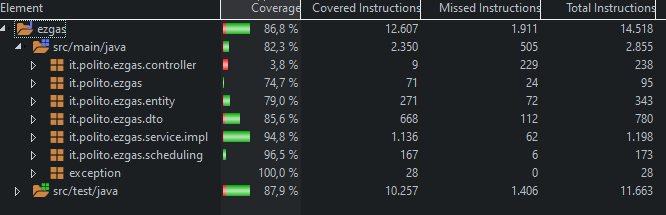

# Integration and API Test Documentation

Authors: Alessandro Borione, Giacomo Garaccione, Corrado Vecchio, Marco Vinai

Date: 23/05/2020

Version: 0.1

# Contents
- [Integration and API Test Documentation](#integration-and-api-test-documentation)
- [Contents](#contents)
- [Dependency graph](#dependency-graph)
- [Integration approach](#integration-approach)
- [Tests](#tests)
	- [Step 1](#step-1)
	- [Step 2](#step-2)
	- [Step 3 - API Tests](#step-3---api-tests)
- [Scenarios](#scenarios)
	- [Scenario UC1.2](#scenario-uc12)
	- [Scenario UC2.2](#scenario-uc22)
	- [Scenario UC2.3](#scenario-uc23)
	- [Scenario UC3.2](#scenario-uc32)
	- [Scenario UC4.2](#scenario-uc42)
	- [Scenario UC4.3](#scenario-uc43)
	- [Scenario UC5.2](#scenario-uc52)
	- [Scenario UC6.2](#scenario-uc62)
	- [Scenario UC7.2](#scenario-uc72)
	- [Scenario UC7.3](#scenario-uc73)
	- [Scenario UC7.4](#scenario-uc74)
	- [Scenario UC7.5](#scenario-uc75)
	- [Scenario UC7.6](#scenario-uc76)
	- [Scenario UC8.2](#scenario-uc82)
	- [Scenario UC8.3](#scenario-uc83)
	- [Scenario UC10.3](#scenario-uc103)
	- [Scenario UC10.4](#scenario-uc104)
	- [Scenario UC10.5](#scenario-uc105)
	- [Scenario UC10.5](#scenario-uc105-1)
- [Coverage of Scenarios and FR](#coverage-of-scenarios-and-fr)
- [Coverage of Non Functional Requirements](#coverage-of-non-functional-requirements)
		- 
- [Line coverage](#line-coverage)

# Dependency graph 

# Integration approach

Bottom up integration:

0. Unit testing -> Entity and Dto classes assumed reliable, since have only basic getters/setters (checks done at upper layers)	 
1. Mapper testing -> UserMapper, LoginMapper, GasStationMapper, ScheduledTasks (Individual test)
2. Service testing -> UserServiceImpl + UserMapper + LoginMapper, GasStationServiceimpl + GasStationMapper + ScheduledTasks
3. API testing -> UserServiceimpl + GasStationServiceimpl

Repository classes implementation is considered reliable, since autogenerated, as well as Entity and DTO classes;
Mockito used in tests for database simulation (fixed results with repository calls).

Routine testing done at this level since rely on repository functions (mocked to simulate database). 
Test done only on computeNewDependability function, since the only properly custom.

#  Tests

## Step 1
|     Classes      |        JUnit test cases        |
| :--------------: | :----------------------------: |
|    UserMapper    |        testToUserDto1()        |
|                  |        testToUserDto2()        |
|                  |        testToUserDto3()        |
|                  |        testToUserDto4()        |
|                  |        testToUserDto5()        |
|                  |        testToUserDto6()        |
|                  |        testToUserDto7()        |
|                  |        testToUserDto8()        |
|                  |         testToUser1()          |
|                  |         testToUser2()          |
|                  |         testToUser3()          |
|                  |         testToUser4()          |
|   LoginMapper    |       testToLoginDto1()        |
|                  |       testToLoginDto2()        |
|                  |       testToLoginDto3()        |
|                  |       testToLoginDto4()        |
| GasStationMapper |          testToGS1()           |
|                  |          testToGS2()           |
|                  |          testToGS3()           |
|                  |          testToGS4()           |
|                  |          testToGS5()           |
|                  |          testToGS6()           |
|                  |         testToGSDto1()         |
|                  |         testToGSDto2()         |
|                  |         testToGSDto3()         |
|                  |         testToGSDto4()         |
|  ScheduledTasks  | testComputeNewDependability1() |
|                  | testComputeNewDependability2() |
|                  | testComputeNewDependability3() |
|                  | testComputeNewDependability4() |
|                  | testComputeNewDependability5() |
|                  | testComputeNewDependability6() |
|                  | testComputeNewDependability7() |
|                  | testComputeNewDependability8() |

## Step 2
|                          Classes                          |            JUnit test cases             |
| :-------------------------------------------------------: | :-------------------------------------: |
|        UserServiceImpl + UserMapper + LoginMapper         |           testGetUserById1()            |
|                                                           |           testGetUserById2()            |
|                                                           |             testSaveUser1()             |
|                                                           |             testSaveUser2()             |
|                                                           |             testSaveUser3()             |
|                                                           |             testSaveUser4()             |
|                                                           |             testSaveUser5()             |
|                                                           |            testDeleteUser1()            |
|                                                           |            testDeleteUser2()            |
|                                                           |              testLogin1()               |
|                                                           |              testLogin2()               |
|                                                           |              testLogin3()               |
|                                                           |           testGetAllUsers1()            |
|                                                           |           testGetAllUsers2()            |
|                                                           |        testIncreaseReputation1()        |
|                                                           |        testIncreaseReputation2()        |
|                                                           |        testIncreaseReputation3()        |
|                                                           |        testIncreaseReputation4()        |
|                                                           |        testDecreaseReputation1()        |
|                                                           |        testDecreaseReputation2()        |
|                                                           |        testDecreaseReputation3()        |
|                                                           |        testDecreaseReputation4()        |
| GasStationServiceimpl + GasStationMapper + ScheduledTasks |        testGetGasStationById1()         |
|                                                           |        testGetGasStationById2()         |
|                                                           |          testSaveGasStation1()          |
|                                                           |          testSaveGasStation2()          |
|                                                           |          testSaveGasStation3()          |
|                                                           |          testSaveGasStation4()          |
|                                                           |          testSaveGasStation5()          |
|                                                           |          testSaveGasStation6()          |
|                                                           |        testGetAllGasStations1()         |
|                                                           |        testGetAllGasStations2()         |
|                                                           |         testDeleteGasStation1()         |
|                                                           |         testDeleteGasStation2()         |
|                                                           |   testGetGasStationsByGasolineType1()   |
|                                                           |   testGetGasStationsByGasolineType2()   |
|                                                           |   testGetGasStationsByGasolineType3()   |
|                                                           |      testGasStationsByProximity1()      |
|                                                           |      testGasStationsByProximity2()      |
|                                                           |      testGasStationsByProximity3()      |
|                                                           |      testGasStationsByProximity4()      |
|                                                           |    testGetGasStationsByCarSharing1()    |
|                                                           |    testGetGasStationsByCarSharing2()    |
|                                                           |    testGetGasStationsByCarSharing3()    |
|                                                           |  testGetGasStationsWithCoordinates1()   |
|                                                           |  testGetGasStationsWithCoordinates2()   |
|                                                           |  testGetGasStationsWithCoordinates3()   |
|                                                           |  testGetGasStationsWithCoordinates4()   |
|                                                           |  testGetGasStationsWithCoordinates5()   |
|                                                           |  testGetGasStationsWithCoordinates6()   |
|                                                           |  testGetGasStationsWithCoordinates7()   |
|                                                           | testGetGasStationsWithoutCoordinates1() |
|                                                           | testGetGasStationsWithoutCoordinates2() |
|                                                           | testGetGasStationsWithoutCoordinates3() |
|                                                           | testGetGasStationsWithoutCoordinates4() |
|                                                           |     testMapGasolineTypeToMethod1()      |
|                                                           |           testPriceCorrect1()           |
|                                                           |           testPriceCorrect2()           |
|                                                           |            testSetReport1()             |
|                                                           |            testSetReport2()             |
|                                                           |            testSetReport3()             |
|                                                           |            testSetReport4()             |

## Step 3 - API Tests

|                 Classes                 | JUnit test cases |
| :-------------------------------------: | :--------------: |
| UserServiceimpl + GasStationServiceimpl |        -         |

Since those implementation are independent, no tests are needed.

# Scenarios

## Scenario UC1.2

| Scenario       |  Create new account with already registered email   |
| -------------- | :-------------------------------------------------: |
| Precondition   |              Account U does not exist               |
|                |       Account with same email already exists        |
| Post condition |                 Error message shown                 |
| Step#          |                     Description                     |
| 1              | U populates fields for account creation and submits |
| 2              |     System checks if email already exists in db     |
| 3              |                 System returns null                 |

## Scenario UC2.2

| Scenario       |   Update account with wrong id   |
| -------------- | :------------------------------: |
| Precondition   | Account U with ID does not exist |
| Post condition |                                  |
| Notes          |         Fail-safe check          |

## Scenario UC2.3

| Scenario       |                Update account setting already registered email                |
| -------------- | :---------------------------------------------------------------------------: |
| Precondition   |                               Account U exists                                |
|                |                   Account with edited email already exists                    |
| Post condition |                              Error message shown                              |
| Step#          |                                  Description                                  |
| 1              | U populates fields for account update and submits, setting email to a new one |
| 2              |  System checks if email already exists in db, and id associated is different  |
| 3              |                              System returns null                              |

## Scenario UC3.2

| Scenario       | Delete non existing account |
| -------------- | :-------------------------: |
| Precondition   |  Account U does not exist   |
| Post condition |       Raise exception       |
| Notes          |       Fail-safe check       |

## Scenario UC4.2

| Scenario       | Create new Gas Station with already registered address |
| -------------- | :----------------------------------------------------: |
| Precondition   |              Gas Station G does not exist              |
|                | Gas Station with the same address as G already exists  |
| Post condition |                  Error message shown                   |
| Step#          |                      Description                       |
| 1              |    Admin inserts all of G's information and submits    |
| 2              |  System checks if address is already in the database   |
| 3              |                  System returns null                   |

## Scenario UC4.3

| Scenario       |     Create new Gas Station with impossible coordinates     |
| -------------- | :--------------------------------------------------------: |
| Precondition   |                Gas Station G does not exist                |
|                | Gas Station's latitude and/or longitude are not acceptable |
| Post condition |                      Exception shown                       |
| Step#          |                        Description                         |
| 1              |      Admin inserts all of G's information and submits      |
| 2              |  System checks if latitude and longitude are both correct  |
| 3              |                 System throws an exception                 |

## Scenario UC5.2

| Scenario       |               Update existing Gas Station with already existing address               |
| -------------- | :-----------------------------------------------------------------------------------: |
| Precondition   |                         Gas Station G exists in the database                          |
|                | Admin wants to update the gas station's address with one used for another Gas Station |
| Post condition |                                    Exception shown                                    |
| Step#          |                                      Description                                      |
| 1              |                   Admin inserts all of G's information and submits                    |
| 2              |                  System checks if address chosen is not already used                  |
| 3              |                              System throws an exception                               |

## Scenario UC6.2

| Scenario       | Delete a Gas Station that does not exist |
| -------------- | :--------------------------------------: |
| Precondition   |       Gas Station G does not exist       |
| Post condition |             Raise exception              |
| Notes          |             Fail-safe check              |

## Scenario UC7.2

| Scenario       | Report on a Gas Station that does not exist |
| -------------- | :-----------------------------------------: |
| Precondition   |        Gas Station G does not exist         |
| Post condition |               Raise exception               |
| Notes          |               Fail-safe check               |

## Scenario UC7.3

| Scenario       | Report on a Gas Station done by a User that does not exist |
| -------------- | :--------------------------------------------------------: |
| Precondition   |                   User U does not exist                    |
| Post condition |                      Raise exception                       |
| Notes          |                      Fail-safe check                       |

## Scenario UC7.4

| Scenario       | Report on a Gas Station with non existing fuel types reported |
| -------------- | :-----------------------------------------------------------: |
| Precondition   |      One/some of the reported fuel types does not exist       |
| Post condition |                        Raise exception                        |
| Notes          |                        Fail-safe check                        |

## Scenario UC7.5

| Scenario       |                    Report on a Gas Station with high dependability (CR4)                    |
| -------------- | :-----------------------------------------------------------------------------------------: |
| Precondition   |                                Gas Station has a report set                                 |
|                | User who submits the new report has lower reputation than the one who made the previous one |
|                |                               Report timestamp - now < 4 days                               |
| Post condition |                                       Raise exception                                       |
| Notes          |                                                                                             |

## Scenario UC7.6

| Scenario       | Report on a Gas Station with obsolete report |
| -------------- | :------------------------------------------: |
| Precondition   |          Gas Station G has a report          |
|                |       report timestamp - now >= 4 days       |
| Post condition |               new report saved               |

## Scenario UC8.2

| Scenario       |  User U inserts incorrect coordinates   |
| -------------- | :-------------------------------------: |
| Precondition   | Latitude and/or longitude are incorrect |
| Post condition |             Raise exception             |
| Notes          |             Fail-safe check             |

## Scenario UC8.3

| Scenario       | User U inserts an invalid fuel type for a given gas station |
| -------------- | :---------------------------------------------------------: |
| Precondition   |        Fuel type does not exist for the gas station         |
| Post condition |                       Raise exception                       |
| Notes          |                       Fail-safe check                       |

## Scenario UC10.3

| Scenario       |       Increase reputation of user with MAX reputation       |
| -------------- | :---------------------------------------------------------: |
| Precondition   |                      Account U exists                       |
|                |                      Account U2 exists                      |
|                |                     GasStation G exists                     |
|                |            U2 reported prices for gas Station G             |
|                |                      U2.reputation = 5                      |
| Post condition |                         No changes                          |
| Step#          |                         Description                         |
| 1              |                   U selects gas station G                   |
| 2              |              U signals price for G is correct               |
| 3              | System searches the user U2 who did signal the prices for G |
| 4              |             System checks if reputation is MAX              |

## Scenario UC10.4

| Scenario       |       Decrease reputation of user with MIN reputation       |
| -------------- | :---------------------------------------------------------: |
| Precondition   |                      Account U exists                       |
|                |                      Account U2 exists                      |
|                |                     GasStation G exists                     |
|                |            U2 reported prices for gas Station G             |
|                |                     U2.reputation = -5                      |
| Post condition |                         No changes                          |
| Step#          |                         Description                         |
| 1              |                   U selects gas station G                   |
| 2              |               U signals price for G is wrong                |
| 3              | System searches the user U2 who did signal the prices for G |
| 4              |             System checks if reputation is MIN              |

## Scenario UC10.5

| Scenario       | Increase reputation of non exixting user |
| -------------- | :--------------------------------------: |
| Precondition   |                                          |
| Post condition |                                          |
| Notes          |             Fail-safe check              |

## Scenario UC10.5

| Scenario       | Decrease reputation of non exixting user |
| -------------- | :--------------------------------------: |
| Precondition   |                                          |
| Post condition |                                          |
| Notes          |             Fail-safe check              |

# Coverage of Scenarios and FR

| Scenario ID | Functional Requirements covered |                                                                                                                       JUnit Test(s)                                                                                                                        |
| :---------: | :-----------------------------: | :--------------------------------------------------------------------------------------------------------------------------------------------------------------------------------------------------------------------------------------------------------: |
|    UC1.1    |          FR1.1, FR1.4           |                                                                                                                      testSaveUser4()                                                                                                                       |
|    UC1.2    |              FR1.4              |                                                                                                                      testSaveUser5()                                                                                                                       |
|    UC2.1    |          FR1.1, FR1.4           |                                                                                                                      testSaveUser1()                                                                                                                       |
|    UC2.2    |              FR1.4              |                                                                                                                      testSaveUser2()                                                                                                                       |
|    UC2.3    |              FR1.4              |                                                                                                                      testSaveUser3()                                                                                                                       |
|    UC3.1    |          FR1.2, FR1.4           |                                                                                                                     testDeleteUser1()                                                                                                                      |
|    UC3.2    |              FR1.4              |                                                                                                                     testDeleteUser2()                                                                                                                      |
|    UC4.1    |              FR3.1              |                                                                                                                   testSaveGasStation1()                                                                                                                    |
|    UC4.2    |              FR3.1              |                                                                                                                   testSaveGasStation4()                                                                                                                    |
|    UC4.3    |              FR3.1              |                                                                                                        testSaveGasStation2(), testSaveGasStation3()                                                                                                        |
|    UC5.1    |              FR3.1              |                                                                                                        testSaveGasStation5(), testSaveGasStation6()                                                                                                        |
|    UC5.2    |              FR3.1              |                                                                                                                   testSaveGasStation4()                                                                                                                    |
|    UC6.1    |              FR3.2              |                                                                                                                  testDeleteGasStation1()                                                                                                                   |
|    UC6.2    |              FR3.2              |                                                                                                                  testDeleteGasStation2()                                                                                                                   |
|    UC7.1    |              FR5.3              |                                                                                                                      testSetReport1()                                                                                                                      |
|    UC7.2    |              FR5.3              |                                                                                                                      testSetReport2()                                                                                                                      |
|    UC7.3    |              FR5.3              |                                                                                                                      testSetReport4()                                                                                                                      |
|    UC7.4    |              FR5.3              |                                                                                                                      testSetReport3()                                                                                                                      |
|    UC7.5    |              FR5.3              |                                                                                                                      testSetReport5()                                                                                                                      |
|    UC7.6    |              FR5.3              |                                                                                                                      testSetReport6()                                                                                                                      |
|    UC8.1    |              FR4.1              |                                                                        testGetGasStationByProximity1(), testGetGasStationWithCoordinates1(), testGetGasStationWithoutCoordinates1()                                                                        |
|    UC8.2    |              FR4.1              |                                                        testGetGasStationByProximity2(), testGetGasStationByProximity3(), testGetGasStationsWithCoordinates2(), testGetGasStationsWithCoordinates3()                                                        |
|    UC8.3    |              FR4.1              |                                                                                        testGetGasStationWithCoordinates4(), testGetGasStationsWithoutCoordinates2()                                                                                        |
|    UC9.1    |              FR5.2              | testComputeNewDependability1(), testComputeNewDependability2()testComputeNewDependability3()testComputeNewDependability4(), testComputeNewDependability5(), testComputeNewDependability6(), testComputeNewDependability7(), testComputeNewDependability8() |
|   UC10.1    |       FR1.4, FR5.3, FR1.1       |                                                                                                    testIncreaseReputation2(), testIncreaseReputation3()                                                                                                    |
|   UC10.2    |       FR1.4, FR5.3, FR1.1       |                                                                                                    testDecreaseReputation1(), testDecreaseReputation2()                                                                                                    |
|   UC10.3    |          FR1.4, FR5.3           |                                                                                                                 testIncreaseReputation1()                                                                                                                  |
|   UC10.4    |          FR1.4, FR5.3           |                                                                                                                 testDecreaseReputation3()                                                                                                                  |
|   UC10.5    |              FR1.4              |                                                                                                                 testIncreaseReputation4()                                                                                                                  |
|   UC10.6    |              FR1.4              |                                                                                                                 testDecreaseReputation4()                                                                                                                  |

# Coverage of Non Functional Requirements

### 

| Non Functional Requirement |               Test name                |
| :------------------------: | :------------------------------------: |
|            NFR2            |                  All                   |
|            NFR6            | testGetGasStationsWithCoordinates1-7() |
|                            |   testGetGasStationsByProximity1-4()   |

# Line coverage

