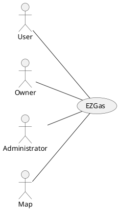

# Requirements Document 

Authors: Alessandro Borione, Giacomo Garaccione, Corrado Vecchio, Marco Vinai

Date: 07/04/2020

Version: 0.1

# Contents

- [Stakeholders](#stakeholders)
- [Context Diagram and interfaces](#context-diagram-and-interfaces)
	+ [Context Diagram](#context-diagram)
	+ [Interfaces](#interfaces) 
	
- [Requirements Document](#requirements-document)
- [Contents](#contents)
- [Stakeholders](#stakeholders)
- [Context Diagram and interfaces](#context-diagram-and-interfaces)
	- [Context Diagram](#context-diagram)
	- [Interfaces](#interfaces)
- [Stories and personas](#stories-and-personas)
- [Functional and non functional requirements](#functional-and-non-functional-requirements)
	- [Functional Requirements](#functional-requirements)
	- [Non Functional Requirements](#non-functional-requirements)
- [Use case diagram and use cases](#use-case-diagram-and-use-cases)
	- [Use case diagram](#use-case-diagram)
		- [Use case 1, UC1](#use-case-1-uc1)
				- [Scenario 1.1](#scenario-11)
				- [Scenario 1.2](#scenario-12)
		- [Use case 2, UC2](#use-case-2-uc2)
		- [Use case](#use-case)
- [Glossary](#glossary)
- [System Design](#system-design)
- [Deployment Diagram](#deployment-diagram)

# Stakeholders

| Stakeholder name  | Description | 
| ----------------- |:-----------:|
| Users             | Use the application to find the best deal in terms of cost/distance for gas and share their experiences with community |
| Owners            | Use the application to insert and update prices and info about their gas stations and services |
| Administror       | Controls the users reports about their experiences in gas stations (comments, errors prices, complaints) |
| Maps Service      | Provides needed maps to the application and offers navigation service |

# Context Diagram and interfaces

## Context Diagram

## Interfaces
| Actor | Logical Interface | Physical Interface  |
| ------------- |:-------------:| -----:|
| User | GUI | Screen/Mouse, Keyboard |
| Owner | GUI | Screen/Mouse, Keyboard |
| Administrator | GUI | Screen/Mouse, Keyboard |
| Maps Service | API | Internet |

# Stories and personas
Mike is a young business owner and he has a great civic sense that lead him to create a platform to help people saving money. The software collects prices of fuels in different stations and provides them to people in order to get gas as cheaper as possible relating with their position. When people need to refuel, they consult the platform to find the nearest station with the lowest price.Mike manages all users reports concerning errors related with gas station position and gas price and he has to handle users. He also has to verify the truthness of gas station owners that want to use his platform to get advertisement, checking their p.iva using the agenzia delle entrate website.

Nathan has a gas station outside a city, near an orbital road and want to be more known by the citizen of the near city. His prices are lower than the competitors and the location is quite strategic, but right now the citizens prefer to go to internal gas station, even if more expensive. Nathan would like to have a way to better advertise his prices.

Joel has a gas station in a highway: prices are quite high due to location, but his services are the best: there are a picnic area, a restaurant, restrooms with showers, a bar, a minimarket and a car wash service. He would like to better advertise his offer, in order to have more customers.

John loves to travel the country riding his truster motorbike. In doing so, he often finds himself with an almost empty tank, and no knowledge of the nearby gas stations. He wants an application on his phone mounted on the bike able to guide him to the nearest gas station. He also wants to compare the different prices and choose the cheapest, since traveling is an expensive hobby per se. Accessing to this platform, he would like to save some favourite gas stations and leave comments or reports of price errors.

Frank is the head master of Vodafone Italia, and he travels around Italy every day. He doesn’t take care of prices because Vodafone covers every costs. So he uses the app to find the nearest station or the one with more services and he is not interested on sharing information with the community. 

# Functional and non functional requirements

## Functional Requirements

| ID        | Description  | Priority |
| ------------- |:-------------:|----:|
|  FR1       |  Manage Account |  |
|  FR1.1     |  Manage user registration | primary |
|  FR1.2     |  Manage owner registration | primary |
|  FR1.3     |  Manage log in | primary |
|  FR1.4     |  Manage account deletion | primary |
|  FR1.5     |  Manage log out | primary |
||||
|  FR2     	 |  Manage Gas station|  |
|  FR2.1     |  Manage Gas station insertion | primary |
|  FR2.2     |  Manage Gas station deletion | primary |
|  FR2.3     |  Manage fuel type insertion | primary |
|  FR2.4     |  Manage fuel price update | primary |
|  FR2.5     |  Manage fuel type deletion | primary |
|  FR2.6     |  Manage service insertion | primary |
|  FR2.7     |  Manage service update | primary |
|  FR2.8     |  Manage service deletion | primary |
||||
|  FR3    	 |   Manage Administrator operations | |
|  FR3.1  	 |   Manage owner account approval | primary |
|  FR3.2   	 |   Manage comment moderation | secondary |
|  FR3.3     |   Manage price error report | secondary |
||||
|  FR4 		 |	 Manage user experience| |
|  FR4.1     |   Get user area of interest | primary |
|  FR4.1.1   |   Get user area of interest by current position|
|  FR4.1.2   |   Get user area of interest by specific city|
|  FR4.2     |   Show map and gas stations| primary |
|  FR4.3     |   Manage selection and display Gas Station info| primary |
|  FR4.3.1 	 |   Manage navigation service | secondary |
|  FR4.4     |   Manage filters | secondary |
|  FR4.5     |   Manage favourites selection | secondary |
|  FR4.6     |   Manage favourites display | secondary |
|  FR4.7     |   Manage favourites deletion | secondary |
|  FR4.8     |   Manage comment insertion | secondary |
|  FR4.9     |   Manage price error report | secondary |

## Non Functional Requirements

| ID        | Type (efficiency, reliability, ..)           | Description  | Refers to |
| ------------- |:-------------:| :-----:| -----:|
| NFR1 | Usability | Application should be usable with no particular training (any user can easliy understand how the application works)  | All FR |
| NFR2 | Performance | All implemented functions should complete in no more than 3-4 seconds (function can return either success or failure) | All FR |
| NFR3 | Portability | The application should run the same way on both smartphone and computer, and on all major Operating System (Linux, Windows, Apple, Android, iOS) | All FR |
| NFR4 | Localization | Prices have three digit decimal precision | FR2, FR4 |

# Use case diagram and use cases

## Use case diagram
\<define here UML Use case diagram UCD summarizing all use cases, and their relationships>

\<next describe here each use case in the UCD>
### Use case 1, UC1
| Actors Involved        |  |
| ------------- |:-------------:| 
|  Precondition     | \<Boolean expression, must evaluate to true before the UC can start> |  
|  Post condition     | \<Boolean expression, must evaluate to true after UC is finished> |
|  Nominal Scenario     | \<Textual description of actions executed by the UC> |
|  Variants     | \<other executions, ex in case of errors> |

##### Scenario 1.1 

\<describe here scenarios instances of UC1>

\<a scenario is a sequence of steps that corresponds to a particular execution of one use case>

\<a scenario is a more formal description of a story>

\<only relevant scenarios should be described>

| Scenario 1.1 | |
| ------------- |:-------------:| 
|  Precondition     | \<Boolean expression, must evaluate to true before the scenario can start> |
|  Post condition     | \<Boolean expression, must evaluate to true after scenario is finished> |
| Step#        | Description  |
|  1     |  |  
|  2     |  |
|  ...     |  |

##### Scenario 1.2

### Use case 2, UC2
..

### Use case
..

# Glossary

\<use UML class diagram to define important concepts in the domain of the system, and their relationships> 

\<concepts are used consistently all over the document, ex in use cases, requirements etc>

# System Design
\<describe here system design>

\<must be consistent with Context diagram>

# Deployment Diagram 

\<describe here deployment diagram >
