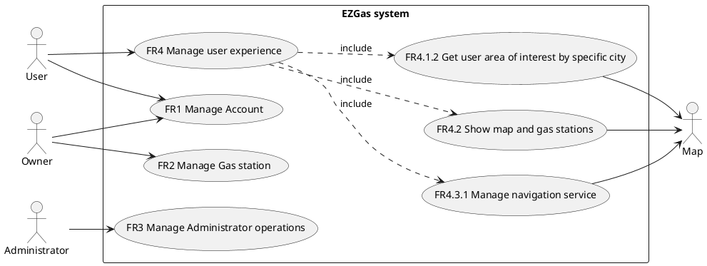
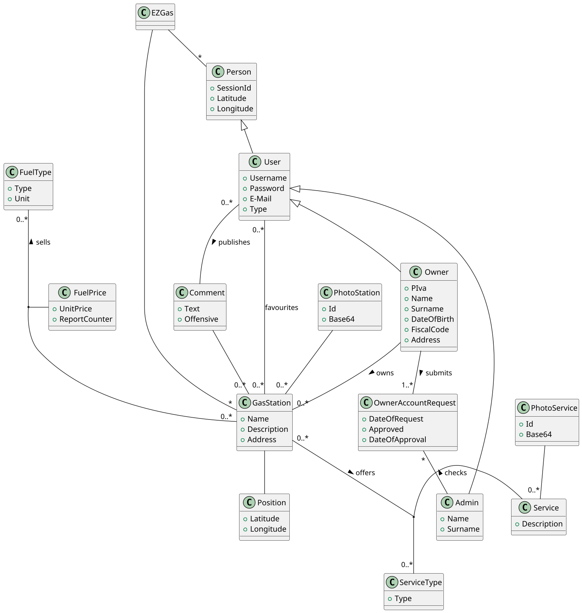

# Requirements Document 

Authors: Alessandro Borione, Giacomo Garaccione, Corrado Vecchio, Marco Vinai

Date: 07/04/2020

Version: 0.1

# Contents

- [Stakeholders](#stakeholders)
- [Context Diagram and interfaces](#context-diagram-and-interfaces)
	+ [Context Diagram](#context-diagram)
	+ [Interfaces](#interfaces) 
	
- [Requirements Document](#requirements-document)
- [Contents](#contents)
- [Stakeholders](#stakeholders)
- [Context Diagram and interfaces](#context-diagram-and-interfaces)
	- [Context Diagram](#context-diagram)
	- [Interfaces](#interfaces)
- [Stories and personas](#stories-and-personas)
- [Functional and non functional requirements](#functional-and-non-functional-requirements)
	- [Functional Requirements](#functional-requirements)
	- [Non Functional Requirements](#non-functional-requirements)
- [Use case diagram and use cases](#use-case-diagram-and-use-cases)
	- [Use case diagram](#use-case-diagram)
- [Use cases](#use-cases)
- [Scenarios](#scenarios)
- [Glossary](#glossary)
- [System Design](#system-design)
- [Deployment Diagram](#deployment-diagram)

# Stakeholders

| Stakeholder name |                                                      Description                                                       |
| ---------------- | :--------------------------------------------------------------------------------------------------------------------: |
| Users            | Use the application to find the best deal in terms of cost/distance for gas and share their experiences with community |
| Owners           |             Use the application to insert and update prices and info about their gas stations and services             |
| Administrator    |        Controls the users reports about their experiences in gas stations (comments, errors prices, complaints)        |
| Maps Service     |                         Provides needed maps to the application and offers navigation service                          |

# Context Diagram and interfaces

## Context Diagram

## Interfaces
| Actor         | Logical Interface |     Physical Interface |
| ------------- | :---------------: | ---------------------: |
| User          |        GUI        | Screen/Mouse, Keyboard |
| Owner         |        GUI        | Screen/Mouse, Keyboard |
| Administrator |        GUI        | Screen/Mouse, Keyboard |
| Maps Service  |        API        |               Internet |

# Stories and personas
Mike is a young business owner and he has a great civic sense that lead him to create a platform to help people saving money. The software collects prices of fuels in different stations and provides them to people in order to get gas as cheaper as possible relating with their position. When people need to refuel, they consult the platform to find the nearest station with the lowest price.Mike manages all users reports concerning errors related with gas station position and gas price and he has to handle users. He also has to verify the truthness of gas station owners that want to use his platform to get advertisement, checking their p.iva using the agenzia delle entrate website.

Nathan has a gas station outside a city, near an orbital road and want to be more known by the citizen of the near city. His prices are lower than the competitors and the location is quite strategic, but right now the citizens prefer to go to internal gas station, even if more expensive. Nathan would like to have a way to better advertise his prices.

Joel has a gas station in a highway: prices are quite high due to location, but his services are the best: there are a picnic area, a restaurant, restrooms with showers, a bar, a minimarket and a car wash service. He would like to better advertise his offer, in order to have more customers.

John loves to travel the country riding his truster motorbike. In doing so, he often finds himself with an almost empty tank, and no knowledge of the nearby gas stations. He wants an application on his phone mounted on the bike able to guide him to the nearest gas station. He also wants to compare the different prices and choose the cheapest, since traveling is an expensive hobby per se. Accessing to this platform, he would like to save some favourite gas stations and leave comments or reports of price errors.

Frank is the head master of Vodafone Italia, and he travels around Italy every day. He doesn’t take care of prices because Vodafone covers every costs. So he uses the app to find the nearest station or the one with more services and he is not interested on sharing information with the community. 

# Functional and non functional requirements

## Functional Requirements

| ID      |                  Description                  |  Priority |
| ------- | :-------------------------------------------: | --------: |
| FR1     |                Manage Account                 |           |
| FR1.1   |           Manage user registration            |   primary |
| FR1.2   |           Manage owner registration           |   primary |
| FR1.3   |                 Manage log in                 |   primary |
| FR1.4   |            Manage account deletion            |   primary |
| FR1.5   |                Manage log out                 |   primary |
|         |                                               |           |
| FR2     |              Manage Gas station               |           |
| FR2.1   |         Manage Gas station insertion          |   primary |
| FR2.2   |          Manage Gas station deletion          |   primary |
| FR2.3   |          Manage fuel type insertion           |   primary |
| FR2.4   |           Manage fuel price update            |   primary |
| FR2.5   |           Manage fuel type deletion           |   primary |
| FR2.6   |           Manage service insertion            |   primary |
| FR2.7   |             Manage service update             |   primary |
| FR2.8   |            Manage service deletion            |   primary |
|         |                                               |           |
| FR3     |        Manage Administrator operations        |           |
| FR3.1   |         Manage owner account approval         |   primary |
| FR3.2   |           Manage comment moderation           | secondary |
| FR3.3   |           Manage price error report           | secondary |
|         |                                               |           |
| FR4     |            Manage user experience             |           |
| FR4.1   |           Get user area of interest           |   primary |
| FR4.1.1 | Get user area of interest by current position |
| FR4.1.2 | Get user area of interest by specific address |
| FR4.2   |           Show map and gas stations           |   primary |
| FR4.3   | Manage selection and display Gas Station info |   primary |
| FR4.3.1 |           Manage navigation service           | secondary |
| FR4.4   |                Manage filters                 | secondary |
| FR4.5   |          Manage favourites selection          | secondary |
| FR4.6   |           Manage favourites display           | secondary |
| FR4.7   |          Manage favourites deletion           | secondary |
| FR4.8   |           Manage comment insertion            | secondary |
| FR4.9   |           Manage price error report           | secondary |

## Non Functional Requirements

| ID   | Type (efficiency, reliability, ..) |                                                                   Description                                                                    | Refers to |
| ---- | :--------------------------------: | :----------------------------------------------------------------------------------------------------------------------------------------------: | --------: |
| NFR1 |             Usability              |               Application should be usable with no particular training (any user can easliy understand how the application works)                |    All FR |
| NFR2 |            Performance             |              All implemented functions should complete in no more than 3-4 seconds (function can return either success or failure)               |    All FR |
| NFR3 |            Portability             | The application should run the same way on both smartphone and computer, and on all major Operating System (Linux, Windows, Apple, Android, iOS) |    All FR |
| NFR4 |            Localization            |                                                    Prices have three digit decimal precision                                                     |  FR2, FR4 |

# Use case diagram and use cases

## Use case diagram

# Use cases
###Use case 1, UC1 - FR1.1 Manage User Registration
| Actors Involved  |                                                     User                                                     |
| ---------------- | :----------------------------------------------------------------------------------------------------------: |
| Precondition     |           User does not already have an existing EZGas account, must also have an existing e-mail            |
| Post condition   |                                        User has a new account created                                        |
| Nominal Scenario | User inserts all his/her information as required by the app, these informations are registered on the system |
| Variants         |            Password is deemed not secure enough, username already exists, e-mail validation fails            |

###Use case 2, UC2 - FR1.2 Manage Owner Registration
| Actors Involved  |                                                                            Owner                                                                            |
| ---------------- | :---------------------------------------------------------------------------------------------------------------------------------------------------------: |
| Precondition     | Owner does not already have an existing EZGas account, must also have an existing e-mail and p.iva, owns a gas station not already registered in the system |
| Post condition   |                                                               Owner has a new account created                                                               |
| Nominal Scenario |                        Owner inserts all his/her information as required by the app, these informations are registered on the system                        |
| Variants         |                                   Password is deemed not secure enough, username already exists, e-mail validation fails                                    |

###Use case 3, UC3 - FR1.3 Manage Log In
| Actors Involved  |                              User, Owner, Adminstrator                               |
| ---------------- | :----------------------------------------------------------------------------------: |
| Precondition     | Person already has an existing EZGas account and is not already logged in in the app |
| Post condition   |                            Person has correctly logged in                            |
| Nominal Scenario |         Person inserts his account informations (e-mail/username, password)          |
| Variants         |                       E-mail/username/password is not correct                        |

###Use case 4, UC4 - FR1.4 Account Deletion
| Actors Involved  |                                    User, Owner, Adminstrator                                     |
| ---------------- | :----------------------------------------------------------------------------------------------: |
| Precondition     |               Person already has an existing EZGas account and wants to delete it                |
| Post condition   |                   Person's account is correctly removed from the EZGas system                    |
| Nominal Scenario | Person chooses to delete his account and, after re-inserting his password, confirms the deletion |
| Variants         |                                     Password is not correct                                      |

###Use case 5, UC5 - FR1.5 Manage Log Out
| Actors Involved  |                           User, Owner, Adminstrator                           |
| ---------------- | :---------------------------------------------------------------------------: |
| Precondition     | Person already has an existing EZGas account and already logged in in the app |
| Post condition   |                        Person has correctly logged out                        |
| Nominal Scenario |                   Person chooses to log out of the account                    |
| Variants         |                                                                               |

###Use case 6, UC6 - FR2.1 Manage Gas Station Insertion
| Actors Involved  |                                                                                     Owner                                                                                     |
| ---------------- | :---------------------------------------------------------------------------------------------------------------------------------------------------------------------------: |
| Precondition     |                                     Owner has logged in with an existing account, the gas station is not already registered in the system                                     |
| Post condition   |                                      The gas station is correctly registered in the system with all its fuel types and associated prices                                      |
| Nominal Scenario | Owner inserts all the informations about the gas station (name, location, fuel types, photo, prices), as required by the app, these informations are registered on the system |
| Variants         |                                                                        Not all form fields are filled                                                                         |

###Use case 7, UC7 - FR2.2 Manage Gas Station Deletion
| Actors Involved  |                                                Owner                                                |
| ---------------- | :-------------------------------------------------------------------------------------------------: |
| Precondition     |  Owner has logged in with an existing account, the gas station is already registered in the system  |
| Post condition   |                        The gas station is correctly removed from the system                         |
| Nominal Scenario | Owner chooses to delete the gas station and, after re-inserting his password, confirms the deletion |
| Variants         |                                       Password is not correct                                       |

###Use case 8, UC8 - FR2.3 Manage Fuel Type Insertion
| Actors Involved  |                                                               Owner                                                               |
| ---------------- | :-------------------------------------------------------------------------------------------------------------------------------: |
| Precondition     | Owner has logged in with an existing account, the gas station is already registered in the system, the fuel type isn't registered |
| Post condition   |                           The fuel type is correctly registered in the system with its associated price                           |
| Nominal Scenario |                                           Owner inserts the new fuel type and its price                                           |
| Variants         |                                                  Not all form fields are filled                                                   |

###Use case 9, UC9 - FR2.4 Manage Fuel Price Update
| Actors Involved  |                                                                       Owner                                                                        |
| ---------------- | :------------------------------------------------------------------------------------------------------------------------------------------------: |
| Precondition     | Owner has logged in with an existing account, the gas station is already registered in the system, the fuel type's associated price is out of date |
| Post condition   |                                 The fuel type is correctly registered in the system with its new associated price                                  |
| Nominal Scenario |                                     Owner chooses the fuel type with out of date price and inserts the new one                                     |
| Variants         |                                                           Not all form fields are filled                                                           |

###Use case 10, UC10 - FR2.5 Manage Fuel Type Deletion
| Actors Involved  |                                                                   Owner                                                                    |
| ---------------- | :----------------------------------------------------------------------------------------------------------------------------------------: |
| Precondition     |                     Owner has logged in with an existing account, the gas station is already registered in the system                      |
| Post condition   |                                 The association fuel type-gas station is correctly removed from the system                                 |
| Nominal Scenario | Owner chooses to delete the fuel type from the ones offered by his gas station and, after re-inserting his password, confirms the deletion |
| Variants         |                                                          Password is not correct                                                           |

###Use case 11, UC11 - FR2.6 Manage Service Insertion
| Actors Involved  |                                                              Owner                                                              |
| ---------------- | :-----------------------------------------------------------------------------------------------------------------------------: |
| Precondition     | Owner has logged in with an existing account, the gas station is already registered in the system, the service isn't registered |
| Post condition   |                                        The service is correctly registered in the system                                        |
| Nominal Scenario |                         Owner inserts the new service and its informations (type, description, photos)                          |
| Variants         |                                                 Not all form fields are filled                                                  |

###Use case 12, UC12 - FR2.7 Manage Service Update
| Actors Involved  |                                                                            Owner                                                                             |
| ---------------- | :----------------------------------------------------------------------------------------------------------------------------------------------------------: |
| Precondition     | Owner has logged in with an existing account, the gas station is already registered in the system, some or all of the service's informations are out of date |
| Post condition   |                                                       The service's informations are correctly updated                                                       |
| Nominal Scenario |                                       Owner chooses the service with out of date informations and inserts the new ones                                       |
| Variants         |                                                                Not all form fields are filled                                                                |

###Use case 13, UC13 - FR2.8 Manage Service Deletion
| Actors Involved  |                                                                      Owner                                                                       |
| ---------------- | :----------------------------------------------------------------------------------------------------------------------------------------------: |
| Precondition     |                        Owner has logged in with an existing account, the gas station is already registered in the system                         |
| Post condition   |                                   The service and all of its information are correctly removed from the system                                   |
| Nominal Scenario | Owner chooses chooses to delete the service from the ones offered by his gas station and, after re-inserting his password, confirms the deletion |
| Variants         |                                                             Password is not correct                                                              |

###Use case 14, UC14 - FR3.1 Manage Owner Account Approval
| Actors Involved  |                                                                 Adminstrator                                                                 |
| ---------------- | :------------------------------------------------------------------------------------------------------------------------------------------: |
| Precondition     |                   Admin is already logged in, Owner has inserted his p.iva, is waiting for the confirmation of his account                   |
| Post condition   |                                              The account is registered as an Owner-type account                                              |
| Nominal Scenario | Admin receives the account request, checks on the Agenzia delle Entrate website if the p.iva is correct and, if it is, registers the account |
| Variants         |                                                           The p.iva does not exist                                                           |
|                  |                                The p.iva owner informations are different from the ones used for the account                                 |

###Use case 15, UC15 - FR3.2 Manage Comment Moderation
| Actors Involved  |                                                           Adminstrator                                                           |
| ---------------- | :------------------------------------------------------------------------------------------------------------------------------: |
| Precondition     |                                      Some User has inserted a comment flagged as offensive                                       |
| Post condition   |                                      The comment is deleted and the User is given a warning                                      |
| Nominal Scenario | Admin checks if the flagged comment is indeed offensive and, if it is, removes it and sends a message to the User that posted it |
| Variants         |                                                   The comment is not offensive                                                   |

###Use case 16, UC16 - FR3.3 Manage Price Error Report
| Actors Involved  |                                                                 Adminstrator                                                                 |
| ---------------- | :------------------------------------------------------------------------------------------------------------------------------------------: |
| Precondition     |       An error in the registered price of some Gas Station has been notified by a large amount of users (at least 10 different users)        |
| Post condition   |                                                     The Gas Station's Owner is notified                                                      |
| Nominal Scenario | Admin receives the different notifications of price errors and, after making sure they come from real users and not bots, contacts the Owner |
| Variants         |                                         The Admin ignores the reports and does not update the Owner                                          |

###Use case 17, UC17 - FR4.1 Get User Area of Interest
| Actors Involved  |                                                          User                                                           |
| ---------------- | :---------------------------------------------------------------------------------------------------------------------: |
| Precondition     |                          User has logged in and wants to know the Gas Station in a chosen area                          |
| Post condition   |                            The application receives the coordinates of the area of interest                             |
| Nominal Scenario | User chooses if he wants to know the Gas Stations close to his current position or to another area, writing its address |
| Variants         |                                               The address does not exist                                                |
|                  |                                          The user's position can't be obtained                                          |

###Use case 18, UC18 - FR4.2 Show Map and Gas Stations
| Actors Involved  |                                                   User, Map Service                                                   |
| ---------------- | :-------------------------------------------------------------------------------------------------------------------: |
| Precondition     |                                         User has decided his area of interest                                         |
| Post condition   |                                                                                                                       |
| Nominal Scenario | The application shows the user all the gas station in a defined range (10-20 Km) centered around the area of interest |
| Variants         |                           Map Service does not work properly and can't load maps correctly                            |

###Use case 19, UC19 - FR4.3 Selection and Display Gas Station Info
| Actors Involved  |                                  User, Map Service                                  |
| ---------------- | :---------------------------------------------------------------------------------: |
| Precondition     |             User has seen the Gas Stations around his area of interest              |
| Post condition   |                                                                                     |
| Nominal Scenario | User chooses a gas station and the application shows all its associated information |
| Variants         |     If a price is reported as wrong a red exclamation mark appears close to it      |

###Use case 20, UC20 - FR4.3.1 Manage Navigation Service
| Actors Involved  |                               User, Map Service                                |
| ---------------- | :----------------------------------------------------------------------------: |
| Precondition     | User has looked at a Gas Station's location and wants to know how to get to it |
| Post condition   |         The User's distance to the Gas Station is lower than 50 meters         |
| Nominal Scenario |    The application shows the directions to follow to get to the gas station    |
| Variants         |                            User takes a wrong turn                             |

###Use case 21, UC21 - FR4.4 Manage Filters
| Actors Involved  |                                                      User                                                      |
| ---------------- | :------------------------------------------------------------------------------------------------------------: |
| Precondition     |            User wants to choose a Gas Station based on more detailed information (prices, services)            |
| Post condition   |                                                                                                                |
| Nominal Scenario | The application reduces the shown gas stations, leaving only the ones that pass the selection made by the user |
| Variants         |                                                                                                                |

###Use case 22, UC22 - FR4.5 Manage Favourites Selection
| Actors Involved  |                                       User                                       |
| ---------------- | :------------------------------------------------------------------------------: |
| Precondition     |    User is already logged in and wants to add to his favourites a Gas Station    |
| Post condition   |        The user's favourites list has been updated with a new gas station        |
| Nominal Scenario | User chooses a gas station and adds it to his favourites using the proper button |
| Variants         |                      The gas station is already registered                       |

###Use case 23, UC23 - FR4.6 Manage Favourites Display
| Actors Involved  |                                         User                                         |
| ---------------- | :----------------------------------------------------------------------------------: |
| Precondition     |        User is already logged and wants to see all his favourite Gas Stations        |
| Post condition   | The user's favourites list is shown, with the option to see the location of each one |
| Nominal Scenario |                User uses the proper button to see all his favourites                 |
| Variants         |                                                                                      |

###Use case 24, UC24 - FR4.7 Manage Favourites Deletion
| Actors Involved  |                                                   User                                                    |
| ---------------- | :-------------------------------------------------------------------------------------------------------: |
| Precondition     |               User is already logged and wants to remove a Gas Station from his favourites                |
| Post condition   |                 The user's favourites list has been updated, with the chosen one removed                  |
| Nominal Scenario | From his list of favourites, the user chooses a gas station to remove and confirms with the proper button |
| Variants         |                                                                                                           |

###Use case 25, UC25 - FR4.8 Manage Comment Insertion
| Actors Involved  |                                               User                                                |
| ---------------- | :-----------------------------------------------------------------------------------------------: |
| Precondition     | User is already logged and wants to share his experience at a specific Gas Station with a comment |
| Post condition   |            The user's comment is added to the list of ones pertaining the gas station             |
| Nominal Scenario |                            The user writes the comment and uploads it                             |
| Variants         |                           Comment is flagged as offensive by the system                           |

###Use case 26, UC26 - FR4.9 Manage Price Error Report
| Actors Involved  |                                           User                                            |
| ---------------- | :---------------------------------------------------------------------------------------: |
| Precondition     |    User is already logged and wants to report a price error in a specific Gas Station     |
| Post condition   |           The gas station segnalation counter for that specific fuel is updated           |
| Nominal Scenario | The user selects the price to report and notifies it to the system witg the proper button |
| Variants         |                                                                                           |

# Scenarios

###Scenario 1.1 

| Scenario 1.1   |                                  Corresponds to UC1                                   |
| -------------- | :-----------------------------------------------------------------------------------: |
| Precondition   |                        User does not have a registered account                        |
| Post condition |                             User has a registered account                             |
| Step#          |                                      Description                                      |
| 1              |                   User opens the app, the home page is shown to him                   |
| 2              |                           User selects the `Sign In` button                           |
| 3              |                      User inserts e-mail, username and password                       |
| 4              | User receives a confirmation mail from the system with a link to activate the account |
| 5              |                                User clicks on the link                                |
| 6              |            User is redirected to the home page and is considered logged in            |

###Scenario 2.1

| Scenario 2.1   |                                           Corresponds to UC2                                           |
| -------------- | :----------------------------------------------------------------------------------------------------: |
| Precondition   |                                Owner does not have a registered account                                |
| Post condition |                                     Owner has a registered account                                     |
| Step#          |                                              Description                                               |
| 1              |                           Owner opens the app, the home page is shown to him                           |
| 2              |                    Owner selects the `Sign In` button and selects `as owner` option                    |
| 3              |             Owner inserts e-mail, username and password, p.iva and anagraphic information              |
| 4              |                              Owner wait for approval by the administrator                              |
| 5              |                         Request is deemed valid [Scenario 14.1](#scenario-141)                         |
| 6              |         Owner receives a confirmation mail from the system with a link to activate the account         |
| 7              |                                        Owner clicks on the link                                        |
| 8              | Owner is redirected to the home page, where he can insert new gas stations and is considered logged in |

###Scenario 2.2

| Scenario 2.2   |                              Corresponds to UC2                               |
| -------------- | :---------------------------------------------------------------------------: |
| Precondition   |                   Owner does not have a registered account                    |
| Post condition |                   Owner does not have a registered account                    |
| Step#          |                                  Description                                  |
| 1              |              Owner opens the app, the home page is shown to him               |
| 2              |       Owner selects the `Sign In` button and selects `as owner` option        |
| 3              | Owner inserts e-mail, username and password, p.iva and anagraphic information |
| 4              |                 Owner wait for approval by the administrator                  |
| 5              |           Request is deemed invalid [Scenario 14.2](#scenario-142)            |
| 6              |       Owner receives a mail from the system with denied request details       |

###Scenario 6.1

| Scenario 6.1   |                                      Corresponds to UC6, UC3                                      |
| -------------- | :-----------------------------------------------------------------------------------------------: |
| Precondition   |      Owner has an existing account, the gas station is not already registered in the system       |
| Post condition |                            A new gas station is inserted in the system                            |
| Step#          |                                            Description                                            |
| 1              |                        Owner opens the app, the home page is shown to him                         |
| 2              |                                 Owner selects the `Log In` button                                 |
| 3              |                        Owner inserts username and password of his account                         |
| 4              |                              Owner selects `Add gas station` option                               |
| 5              | Owner inserts gas station information (name, location, description, photo, fuel types and prices) |
| 6              |                     Owner selects `Submit`, and the system sends him a e-mail                     |
| 7              |                       Owner is redirected to the new gas station info page                        |

###Scenario 8.1

| Scenario 8.1   |                                                        Corresponds to UC8                                                         |
| -------------- | :-------------------------------------------------------------------------------------------------------------------------------: |
| Precondition   | Owner has logged in with an existing account, the gas station is already registered in the system, the fuel type isn't registered |
| Post condition |                                         A new fuel type is added to the gas station page                                          |
| Step#          |                                                            Description                                                            |
| 1              |                                                Owner selects gas station to update                                                |
| 2              |                                               Owner selects `Add fuel type` option                                                |
| 3              |                                                 Owner inserts fuel type and price                                                 |
| 4              |                                     Owner selects `Submit`, and the system sends him a e-mail                                     |
| 5              |                                     Owner is redirected to the updated gas station info page                                      |

###Scenario 9.1

| Scenario 9.1   |                                                                Corresponds to UC9                                                                |
| -------------- | :----------------------------------------------------------------------------------------------------------------------------------------------: |
| Precondition   | Owner has logged in with an existing account, the gas station is already registered in the system, the fuel type associated price is out of date |
| Post condition |                                The fuel type is corrected registered to the system with its new associated price                                 |
| Step#          |                                                                   Description                                                                    |
| 1              |                                                       Owner selects gas station to update                                                        |
| 2              |                                                       Owner selects a registered fuel type                                                       |
| 3              |                                                       Owner selects `Change price` option                                                        |
| 4              |                                              Owner inserts new price associated with the fuel type                                               |
| 5              |                                                              Owner selects `Submit`                                                              |
| 6              |                                             Owner is redirected to the updated gas station info page                                             |

###Scenario 11.1

| Scenario 11.1  |                                                       Corresponds to UC11                                                       |
| -------------- | :-----------------------------------------------------------------------------------------------------------------------------: |
| Precondition   | Owner has logged in with an existing account, the gas station is already registered in the system, the service isn't registered |
| Post condition |                                        The service is correctly registered in the system                                        |
| Step#          |                                                           Description                                                           |
| 1              |                                               Owner selects gas station to update                                               |
| 2              |                                               Owner selects `Add service` option                                                |
| 3              |                                  Owner inserts service information (type, description, photo)                                   |
| 4              |                                    Owner selects `Submit`, and the system sends him a e-mail                                    |
| 5              |                                    Owner is redirected to the updated gas station info page                                     |

###Scenario 11.2

| Scenario 11.2  |                                                       Corresponds to UC11                                                       |
| -------------- | :-----------------------------------------------------------------------------------------------------------------------------: |
| Precondition   | Owner has logged in with an existing account, the gas station is already registered in the system, the service isn't registered |
| Post condition |                                        The service is correctly registered in the system                                        |
| Step#          |                                                           Description                                                           |
| 1              |                                               Owner selects gas station to update                                               |
| 2              |                                               Owner selects `Add service` option                                                |
| 3              |                                          Owner inserts incomplete service information                                           |
| 4              |                              Owner selects `Submit`, and is shown an error message (missing type)                               |
| 5              |                                            Owner fills in missing parts of the form                                             |
| 6              |                                    Owner selects `Submit`, and the system sends him a e-mail                                    |
| 7              |                                    Owner is redirected to the updated gas station info page                                     |

###Scenario 14.1

| Scenario 14.1  |                              Corresponds to UC14, UC3                               |
| -------------- | :---------------------------------------------------------------------------------: |
| Precondition   |    Owner has inserted his p.iva, is waiting for the confirmation of his account     |
| Post condition |                 The account is registered as an Owner-type account                  |
| Step#          |                                     Description                                     |
| 1              |                 Admin opens the app, the home page is shown to him                  |
| 2              |                          Admin selects the `Log In` button                          |
| 3              |                 Admin inserts username and password of his account                  |
| 4              |                    Admin selects `Pending registration requests`                    |
| 5              |                          Admin selects one of the requests                          |
| 6              | Admin verifies p.iva and Owner account information on Agenzia delle Entrate website |
| 7              |                              Admin accepts the request                              |

###Scenario 14.2

| Scenario 14.2  |                                           Corresponds to UC14                                            |
| -------------- | :------------------------------------------------------------------------------------------------------: |
| Precondition   | Admin is already logged in, Owner has inserted his p.iva, is waiting for the confirmation of his account |
| Post condition |                                     The account creation is rejected                                     |
| Step#          |                                               Description                                                |
| 1              |                              Admin selects `Pending registration requests`                               |
| 2              |                                    Admin selects one of the requests                                     |
| 3              |           Admin verifies p.iva and Owner account information on Agenzia delle Entrate website            |
| 4              |       Information inserted by the Owner do not match the ones in the Agenzia delle Entrate website       |
| 5              |                                        Admin rejects the request                                         |

###Scenario 20.1

| Scenario 20.1  |                                             Corresponds to UC20, UC17, UC18, UC19                                              |
| -------------- | :----------------------------------------------------------------------------------------------------------------------------: |
| Precondition   |                                            Gas Station is registered in the system                                             |
| Post condition |                                    Distance between gas station and User is less than 50 m                                     |
| Step#          |                                                          Description                                                           |
| 1              |                                          User selects `Serach` using current position                                          |
| 2              | System shows map centered around the user location, based on a selected range, and paints on top of it the nearby gas stations |
| 3              |                                        Users selects one of the displayed gas stations                                         |
| 4              |                                                  User selects `Travel` option                                                  |
| 5              |                                      System retrieves list of directions from Map Service                                      |  |
| 6              |                                                    App shows next direction                                                    |
| 7              |                                               Users moves to indicated location                                                |
|                |                                     Repeat steps *6* and *7* until gas station is reached                                      |

###Scenario 22.1

| Scenario 22.1  |                                             Corresponds to UC22, UC17, UC18, UC19                                             |
| -------------- | :---------------------------------------------------------------------------------------------------------------------------: |
| Precondition   |                                                  Users is already logged in                                                   |
| Post condition |                                                   Favourite list is updated                                                   |
| Step#          |                                                          Description                                                          |
| 1              |                                      User inserts a valid address, and selects `Serach`                                       |
| 2              | System shows map centered on the inserted address, based on a selected range, and paints on top of it the nearby gas stations |
| 3              |                                        Users selects one of the displayed gas stations                                        |
| 4              |                                          System shows gas stations information page                                           |
| 5              |                                            User selects `Add to favourites` option                                            |

###Scenario 25.1

| Scenario 25.1  |                      Corresponds to UC25, UC23                       |
| -------------- | :------------------------------------------------------------------: |
| Precondition   | Users is already logged in, Gas Station is in User's favourites list |
| Post condition |       Comment is inserted on the system and shown on the page        |
| Step#          |                             Description                              |
| 1              |                    User selects `Show favourites`                    |
| 2              |           Users selects one of the displayed gas stations            |
| 3              |              System shows gas stations information page              |
| 4              |                User writes a comment in the text area                |
| 5              |                     User selects `Submit` option                     |

###Scenario 26.1

| Scenario 26.1  |                                           Corresponds to UC26, UC3, UC17, UC18, UC19                                           |
| -------------- | :----------------------------------------------------------------------------------------------------------------------------: |
| Precondition   |      Gas Station is already registered in the system, User has a registered account, Displayed fuel price is not updated       |
| Post condition |                             The gas station segnalation counter for that specific fuel is updated                              |
| Step#          |                                                          Description                                                           |
| 1              |                                          User selects `Serach` using current position                                          |
| 2              | System shows map centered around the user location, based on a selected range, and paints on top of it the nearby gas stations |
| 3              |                                        Users selects one of the displayed gas stations                                         |
| 4              |                                          User selects one of the displayed fuel types                                          |
| 5              |                                          User selects `Report Error in Price` option                                           |
| 6              |                                           System displays an error (log in/sign up)                                            |
| 7              |                                                User backtracks to the home page                                                |
| 8              |                                  User logs in inserting username and password of his account                                   |
|                |                                               User repeats steps from *1* to *5*                                               |

# Glossary

# System Design
\<describe here system design>

\<must be consistent with Context diagram>

# Deployment Diagram 

\<describe here deployment diagram >

