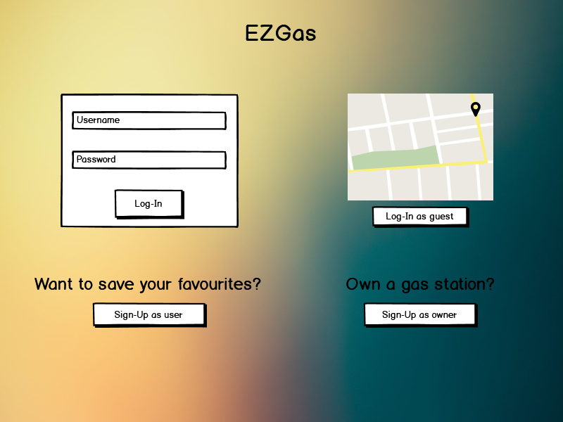
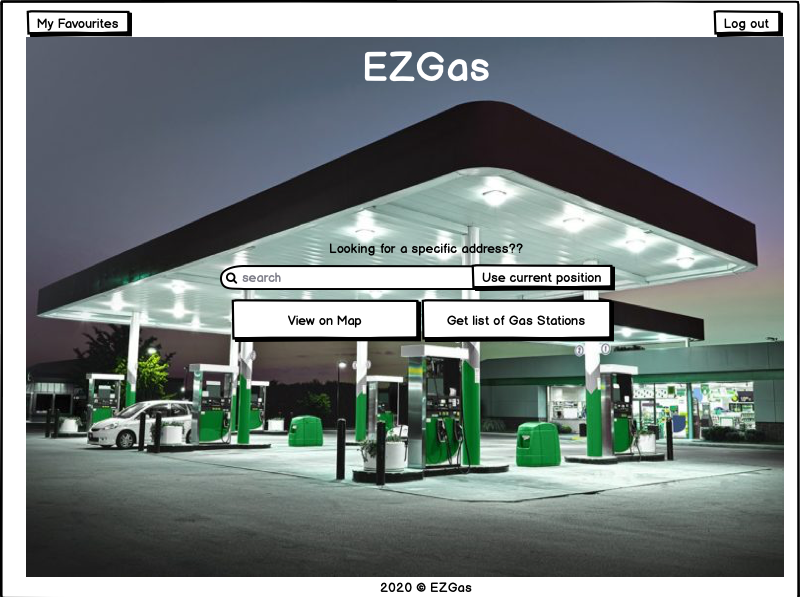
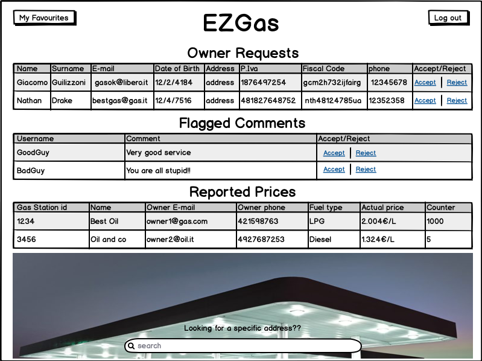

# Graphical User Interface Prototype  

Authors: Alessandro Borione, Giacomo Garaccione, Corrado Vecchio, Marco Vinai

Date: 15/04/2020

Version: 1.0

# Contents
- [Graphical User Interface Prototype](#graphical-user-interface-prototype)
- [Contents](#contents)
  - [Log In Page](#log-in-page)
  - [Sign Up](#sign-up)
    - [Sign Up as User](#sign-up-as-user)
    - [Sign Up as Owner](#sign-up-as-owner)
  - [Homepage](#homepage)
    - [Homepage Guest](#homepage-guest)
    - [Homepage Logged In User](#homepage-logged-in-user)
    - [Homepage Owner](#homepage-owner)
    - [Homepage Admin](#homepage-admin)
  - [Map](#map)
    - [Search Map](#search-map)
    - [Filter Selection On Map](#filter-selection-on-map)
    - [Filtered Map](#filtered-map)
    - [Favourites Selection On Map](#favourites-selection-on-map)
  - [Gas Stations As List](#gas-stations-as-list)
    - [Favourites](#favourites)
    - [Search Result](#search-result)
    - [Search Result Filtered](#search-result-filtered)
  - [Gas Station Page](#gas-station-page)
    - [User View](#user-view)
    - [Owner View](#owner-view)
  - [Owner Functionalities](#owner-functionalities)
    - [Insert Gas Station](#insert-gas-station)
    - [Add Fuel Type](#add-fuel-type)
    - [Add Service](#add-service)
  - [General notes](#general-notes)

## Log In Page
 
GUI shown when everyone opens the app. It allows to access as [owner](#homepage-owner), [user](#homepage-logged-in-user) or [admin](#homepage-admin) by inserting username and password but also to use the application as [guest](#homepage-guest) with limited functionalities. There is also the possibility to sign up [as owner](#sign-up-as-owner) or [as user](#sign-up-as-user).
## Sign Up 
### Sign Up as User
 
Refers to [Use Case 1](RequirementsDocument.md#use-case-1-uc1-fr11-manage-user-registration). 
GUI shown when an user decides to create a new account on EZGas application. All displayed fields are mandatory.
### Sign Up as Owner
 
Refers to [Use Case 2](RequirementsDocument.md#use-case-2-uc2-fr12-manage-owner-registration). 
GUI shown when an owner decides to create a new account on EZGas application. All displayed fields are mandatory. 
## Homepage
### Homepage Guest 
 
GUI shown when a guest user accesses the app. He can use his current position or insert a specific address in order to open the [map view](#map) with the available gas stations or to get a [list](#search-result) of the same gas stations. It also offers the chance to log in or to [sign up](#sign-up-as-user). 
### Homepage Logged In User
 
Refers to starting point of [Scenarios 20.1](RequirementsDocument.md#scenario-201), [22.1](RequirementsDocument.md#scenario-221), [25.1](RequirementsDocument.md#scenario-251), [26.1](RequirementsDocument.md#scenario-261) 
GUI shown to registered user when he accesses the app. It offers the same functionalities as the guest version with the addition of a button to [show favourites](#favourites) and one to log out. 
### Homepage Owner
 
Refers to step 7 of [Scenario 2.1](RequirementsDocument.md#scenario-21), step 4 of [Scenario 6.1](RequirementsDocument.md#scenario-61), starting point of [Scenario 8.1](RequirementsDocument.md#scenario-81), [Scenario 9.1](RequirementsDocument.md#scenario-91), [Scenario 11.1](RequirementsDocument.md#scenario-111) and [Scenario 11.2](RequirementsDocument.md#scenario-112). 
GUI shown when a registered owner accesses to the app. Since an Owner is considered an extension of a LoggedUser, the GUI offers the same functionalities, with the addition of a table containing his gas stations. There is a button to [add a gas station](#insert-gas-station). Clicking on a gas station from the table, the owner is redirected to the [Gas Station page](#owner-view).

### Homepage Admin
 
Refers to starting point of [Scenario 14.1](RequirementsDocument.md#scenario-141), starting point of [Scenario 14.2](RequirementsDocument.md#scenario-142)
GUI shown when the admin accesses the app. It shows the owner requests not managed yet, a list of all comments flagged as offensive and a list of all reported prices with the associated report counter.

## Map

### Search Map
 
Refers to step 2 of [Scenario 20.1](RequirementsDocument.md#scenario-201), step 2 of [Scenario 22.1](RequirementsDocument.md#scenario-221), step 2 of [Scenario 26.1](RequirementsDocument.md#scenario-261)
GUI shown when a user decides the area of interest and clicks "View on Map" on the homepage. It shows all Gas Stations' positions with a list of the fuel types they offer and the associated price. In the higher side of the page there are buttons used to go back to the homepage, to [show the user's list of favourites](#favourites-selection-on-map), to [apply filters to the searched gas stations](#filter-selection-on-map), to input a new address and to log out. If a Gas Station is clicked the user gets redirected to [its page](#user-view).

### Filter Selection On Map
 
Refers to [Use Case 21](RequirementsDocument.md#use-case-21-uc21-fr44-manage-filters)
GUI shown when a user clicks on the "Apply Filter" button. The menu allows to limit the number of results showing only the ones matching the chosen fuel types and/or services. After clicking on the "Go" button the [map](#filtered-map) is updated to only show the matching gas stations.

### Filtered Map
 
Refers to [Use Case 21](RequirementsDocument.md#use-case-21-uc21-fr44-manage-filters)
GUI shown after the selection of filters in the normal map. The filters are applied and the gas stations that don't match are removed.

### Favourites Selection On Map
 
Refers to [Use Case 23](RequirementsDocument.md#use-case-23-uc23-fr46-manage-favourites-display)
GUI shown when an user clicks on the "★" button. Clicking on the blue arrow button starts the navigation to the gas station ([Use Case 20](RequirementsDocument.md#use-case-20-uc20-fr431-manage-navigation-service)) while clicking on the gas station name redirects to the [gas station page](#user-view). The distance is calculated as the crow flies.

## Gas Stations As List

### Favourites
 
Refers to steps 1, 2 of [Scenario 25.1](RequirementsDocument.md#scenario-251)
GUI shown when a LoggedUser clicks on the "My Favourites" button in the homepage. It shows all information of the favourites, clicking on the gas station name redirects to the [gas station page](#user-view), clicking on the position marker shows the gas station's location on the [map](#search-map). It is possible to apply filters to the list and also to change the way the list is sorted. Services are represented only by their icon, without the description.

### Search Result
 
Refers to [Use Case 18](RequirementsDocument.md#use-case-18-uc18-fr42-show-maplist-of-gas-stations)
GUI shown when a User clicks on the "Get List of Gas Stations" button in the homepage. It shows all information of the gas stations in range of the selected area of interest, clicking on the gas station name redirects to the [gas station page](#user-view), clicking on the position marker shows the gas station's location on the [map](#search-map). It is possible to apply filters to the list and also to change the way the list is sorted. Services are represented only by their icon, without the description.
Clicking on the ☆ button allows a logged in user to add the gas station to his favourites.
The search bar allows to change the area of interest, while clicking on the map icon redirects to the [map](#search-map).

### Search Result Filtered
 
Refers to [Use Case 21](RequirementsDocument.md#use-case-21-uc21-fr44-manage-filters)
Pop-up shown when a User clicks on the filter icon. It allows to select specific fuel types and/or services to restrict the list, showing only the gas stations that match the criteria.

## Gas Station Page

### User View
 
Refers to [Use Case 19](RequirementsDocument.md#use-case-19-uc19-fr43-selection-and-display-gas-station-info), step 4 of [Scenario 22.1](RequirementsDocument.md#scenario-221), steps 3, 4, 5 of [Scenario 25.1](RequirementsDocument.md#scenario-251), steps 4, 5 of [Scenario 26.1](RequirementsDocument.md#scenario-261)
GUI shown when an User wants to see more information about a specific gas station, including all offered services. It is possible to leave a comment by filling the form and clicking the "Leave a comment" button ([Use Case 25](RequirementsDocument.md#use-case-25-uc25-fr48-manage-comment-insertion)), to report an error in fuel price by clicking the report button ([Use Case 26](RequirementsDocument.md#use-case-26-uc26-fr49-manage-price-error-report)) and to add the gas station to the list of favourites by clicking on the ☆ shaped button near the name.
A guest can only see the information because all of the buttons are disabled for non logged in users.

### Owner View
 
Refers to steps 1, 2 of [Scenario 8.1](RequirementsDocument.md#scenario-81), steps 1, 2, 3 of [Scenario 9.1](RequirementsDocument.md#scenario-91), steps 1, 2 of [Scenario 11.1](RequirementsDocument.md#scenario-111), steps 1, 2 of [Scenario 11.2](RequirementsDocument.md#scenario-112)
GUI shown to the owner of the specific gas station. It allows the owner to edit the prices of the offered fuel types with the "Change Price" button ([Use Case 9](RequirementsDocument.md#use-case-9-uc9-fr24-manage-fuel-price-update)), to [add a new fuel type](#add-fuel-type) with the corresponding button ([Use Case 8](RequirementsDocument.md#use-case-8-uc8-fr23-manage-fuel-type-insertion)), to [add a new service](#add-service) with the corresponding button ([Use Case 11](RequirementsDocument.md#use-case-11-uc11-fr26-manage-service-insertion)) and to remove services or fuel types no longer offered ([Use Case 10](RequirementsDocument.md#use-case-10-uc10-fr25-manage-fuel-type-deletion) and [Use Case 13](RequirementsDocument.md#use-case-13-uc13-fr28-manage-service-deletion)) by clicking on the small red cross, which shows a pop-up asking for the password to confirm the deletion.

## Owner Functionalities

### Insert Gas Station
 
Refers to steps 5, 6 of [Scenario 6.1](RequirementsDocument.md#scenario-61)
Form shown when an owner clicks on the "Add a Gas Station" button in the [homepage](#homepage-owner). It contains textboxes for all important information and a list of drop-down menus for choosing all offered fuel types. Adding an image and inserting a description are not mandatory.

### Add Fuel Type
 
Refers to [Use Case 8](RequirementsDocument.md#use-case-8-uc8-fr23-manage-fuel-type-insertion), steps 3, 4 of [Scenario 8.1](RequirementsDocument.md#scenario-81)
Pop-up shown when an owner clicks on the "Add Fuel Type" button in a [gas station page](#owner-view). It contains a drop-down menu listing all possible fuel types and a textbox to be filled with its price.

### Add Service
 
Refers to steps 3, 4 of [Scenario 11.1](RequirementsDocument.md#scenario-111)
Pop-up shown when an owner clicks on the "Add Service" button in a [gas station page](#owner-view). It contains a drop-down menu listing all possible services and a text area to be filled with its description.

## General notes
All pages shown to a guest user have in the upper part of the page both the log in form and the sign up button, while all pages shown to a logged in user have in the same spot the log out button and the "My Favourites" button.
