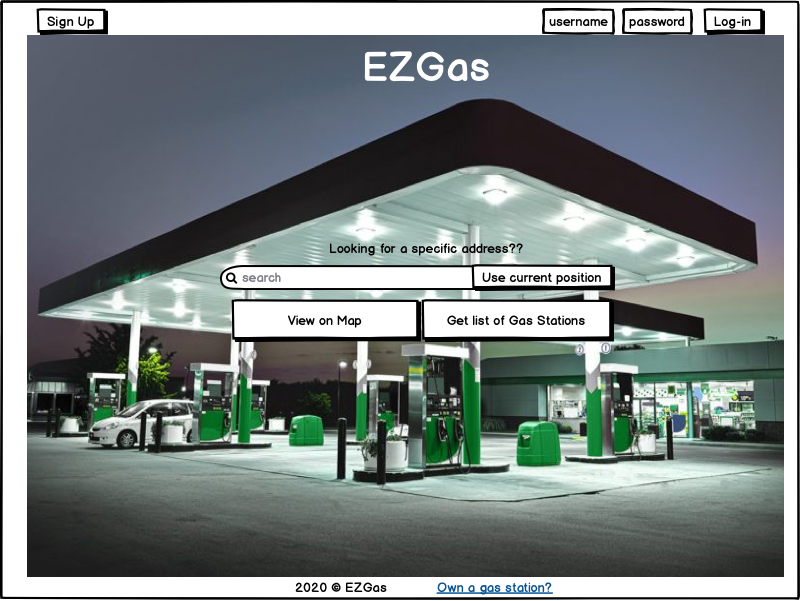

# Graphical User Interface Prototype  

Authors: Alessandro Borione, Giacomo Garaccione, Corrado Vecchio, Marco Vinai

Date: 15/04/2020

Version: 1.1
## Log In Page

GUI shown when everyone opens the app. It allows to access as [owner](#homepage-owner), [user](#homepage-logged-in-user) or [admin](#homepage-admin) by inserting username and password but also to use the application as [guest](#homepage-guest) with limited functionalities. There is also the possibility to sign up [as owner](#sign-up-as-owner) or [as user](#sign-up-as-user).
## Sign Up 
### Sign Up as User

Manages [UC1](RequirementsDocument.md#use-case-1-uc1---fr11-manage-user-registration). 
GUI shown when an user decides to create a new account on EZGas application. All displayed fields are mandatory.
### Sign Up as Owner

Manages [UC2](RequirementsDocument.md#use-case-2-uc2---fr12-manage-owner-registration). 
GUI shown when an owner decides to create a new account on EZGas application. All displayed fields are mandatory. 
## Homepage
### Homepage Guest 

GUI shown when a guest user accesses the app. He can use his current position or insert a specific address in order to open the [map view](#map) with the available gas stations or to get a [list] of the same gas stations. It also offers the chance to log in or to [sign up](#sign-up-as-user). 
### Homepage Logged In User

Refers to starting point of Scenarios [20.1](RequirementsDocument.md#scenario201), [22.1](RequirementsDocument.md#scenario221), [25.1](RequirementsDocument.md#scenario251), [26.1](RequirementsDocument.md#scenario261) 
GUI shown to registered user when he accesses the app. It offers the same functionalities as the guest version with the addition of a button to show favourites and one to log out. 
### Homepage Owner

Refers to step 8 of Scenarios [2.1](RequirementsDocument.md#scenario21), step 4 of Scenario [6.1](RequirementsDocument.md#scenario61), starting point of Scenario [8.1](RequirementsDocument.md#scenario81), Scenario [9.1](RequirementsDocument.md#scenario91), Scenario [11.1](RequirementsDocument.md#scenario111) and Scenario [11.2](RequirementsDocument.md#scenario112). 
GUI shown when a registered owner accesses to the app. Since an owner is considered an extension of a normal user, the GUI offers the same functionalities as the user homepage with the addition of a table containing his gas stations. There is a button to [add a gas station](Add Gas Station).
### Homepage Admin

## Map

\<Report here the GUI that you propose. You are free to organize it as you prefer. A suggested presentation matches the Use cases and scenarios defined in the Requirement document. The GUI can be shown as a sequence of graphical files (jpg, png)  >
