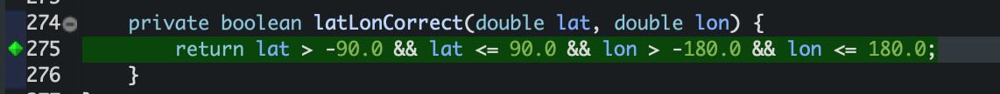

# Unit Testing Documentation

Authors: Alessandro Borione, Giacomo Garaccione, Corrado Vecchio, Marco Vinai

Date: 13/05/2020

Version: 0.1

# Contents

- [Black Box Unit Tests](#black-box-unit-tests)

- [White Box Unit Tests](#white-box-unit-tests)

# Black Box Unit Tests

    <Define here criteria, predicates and the combination of predicates for each function of each class.
    Define test cases to cover all equivalence classes and boundary conditions.
    In the table, report the description of the black box test case and (traceability) the correspondence with the JUnit test case writing the 
    class and method name that contains the test case>
    <JUnit test classes must be in src/test/java/it/polito/ezgas   You find here, and you can use,  class EZGasApplicationTests.java that is executed before 
    the set up of all Spring components
    >

 ### Class GasStationServiceimpl - method isGasolineTypeValid

**Criteria for method isGasolineTypeValid:**	
 - String Length
 - Correct Content

**Predicates for method isGasolineTypeValid:**

|    Criteria     |      Predicate      |
| :-------------: | :-----------------: |
|  String Length  |          0          |
|                 |         >0          |
| Correct Content |    Gasoline type    |
|                 | Not a gasoline type |

**Boundaries**:

|    Criteria     | Boundary values |
| :-------------: | :-------------: |
| Correct Content |      null       |

**Combination of predicates**:

| String Length |   Correct Content   | Valid / Invalid | Description of the test case |      JUnit test case       |
| :-----------: | :-----------------: | :-------------: | :--------------------------: | :------------------------: |
|       0       |          -          |     Invalid     |    Input string is empty     | testIsGasolineTypeValid1() |
|      > 0      | Not a gasoline type |     Invalid     |    Input string is "ciao"    | testIsGasolineTypeValid2() |
|      > 0      |    Gasoline Type    |      Valid      |  Input string is "Methane"   | testIsGasolineTypeValid3() |
|       -       |        null         |     Invalid     |     Input string is null     | testIsGasolineTypeValid9() |

 ### Class GasStationServiceimpl - method geoPointDistance

**Criteria for method geoPointDistance:**	
-Correct latitude
-Correct longitude 

**Predicates for method geoPointDistance:**

|      Criteria      |    Predicate     |
| :----------------: | :--------------: |
| Correct latitude1  |  -90<`lat1`<=90  |
| Correct longitude1 | -180<`lon1`<=180 |
| Correct latitude2  |  -90<`lat2`<=90  |
| Correct longitude2 | -180<`lon2`<=180 |

**Boundaries**:

|      Criteria      |       Boundary values       |
| :----------------: | :-------------------------: |
| Correct latitude1  | -90 + Double.MIN_INCREMENT  |
|                    |  90 - Double.MIN_INCREMENT  |
|                    |             90              |
| Correct longitude1 | -180 + Double.MIN_INCREMENT |
|                    | 180 - Double.MIN_INCREMENT  |
|                    |             180             |
| Correct latitude2  | -90 + Double.MIN_INCREMENT  |
|                    |  90 - Double.MIN_INCREMENT  |
|                    |             90              |
| Correct longitude2 | -180 + Double.MIN_INCREMENT |
|                    | 180 - Double.MIN_INCREMENT  |
|                    |             180             |

**Combination of predicates**:

|     Correct Latitude1      |     Correct Longitude1      |     Correct Latitude2      |     Correct Longitude2      | Valid / Invalid |            Description of the test case            |     JUnit test case      |
| :------------------------: | :-------------------------: | :------------------------: | :-------------------------: | :-------------: | :------------------------------------------------: | :----------------------: |
|       -90<`lat1`<=90       |      -180<`lon1`<=180       |       -90<`lat2`<=90       |      -180<`lon2`<=180       | Valid(10051.81) |             (-30.10;-100.2;-40.6;20.3)             | testGeoPointDistance1()  |
| -90 + Double.MIN_INCREMENT |      -180<`lon1`<=180       |       -90<`lat2`<=90       |      -180<`lon2`<=180       | Valid(12278.67) |  (-90 + Double.MIN_INCREMENT;-100.45;20.43;61.6)   | testGeoPointDistance2()  |
| 90 - Double.MIN_INCREMENT  |      -180<`lon1`<=180       |       -90<`lat2`<=90       |      -180<`lon2`<=180       | Valid(12853.52) |   (90 - Double.MIN_INCREMENT;65.21;-25.6;120.34)   | testGeoPointDistance3()  |
|             90             |      -180<`lon1`<=180       |       -90<`lat2`<=90       |      -180<`lon2`<=180       | Valid(12975.82) |               (90;89.90;-26.7;55.7)                | testGeoPointDistance4()  |
|       -90<`lat1`<=90       | -180 + Double.MIN_INCREMENT |       -90<`lat2`<=90       |      -180<`lon2`<=180       | Valid(11129.19) |  (-30.4;-180 + Double.MIN_INCREMENT;36.43;-100.4)  | testGeoPointDistance5()  |
|       -90<`lat1`<=90       | 180 - Double.MIN_INCREMENT  |       -90<`lat2`<=90       |      -180<`lon2`<=180       | Valid(11587.9)  | (29.09;180 - Double.MIN_INCREMENT;-50.34;-103.34)  | testGeoPointDistance6()  |
|       -90<`lat1`<=90       |             180             |       -90<`lat2`<=90       |      -180<`lon2`<=180       | Valid(7291.82)  |             (-45.54;180;-21.43;103.54)             | testGeoPointDistance7()  |
|       -90<`lat1`<=90       |      -180<`lon1`<=180       | -90 + Double.MIN_INCREMENT |       180<`lon2`<=180       | Valid(12477.69) |  (22.22;-102.34;-90 + Double.MIN_INCREMENT;27.76)  | testGeoPointDistance8()  |
|       -90<`lat1`<=90       |      -180<`lon1`<=180       | 90 - Double.MIN_INCREMENT  |       180<`lon2`<=180       | Valid(18986.73) | (-80.76;-170.54;90 - Double.MIN_INCREMENT;102.54)  | testGeoPointDistance9()  |
|       -90<`lat1`<=90       |      -180<`lon1`<=180       |             90             |       180<`lon2`<=180       | Valid(14850.48) |              (-43.56;109.34;90;99.09)              | testGeoPointDistance10() |
|       -90<`lat1`<=90       |      -180<`lon1`<=180       |       -90<`lat2`<=90       | -180 + Double.MIN_INCREMENT |  Valid(6366.8)  | (-30.54;103.54;-76.76;-180 + Double.MIN_INCREMENT) | testGeoPointDistance11() |
|       -90<`lat1`<=90       |      -180<`lon1`<=180       |       -90<`lat2`<=90       | 180 - Double.MIN_INCREMENT  | Valid(6510.84)  |   (31.67;66.78;89.43;180 - Double.MIN_INCREMENT)   | testGeoPointDistance12() |
|       -90<`lat1`<=90       |      -180<`lon1`<=180       |       -90<`lat2`<=90       |             180             | Valid(8846.99)  |              (55.76;-59.76;30.88;180)              | testGeoPointDistance13() |

 ### Class GasStationServiceimpl - method latLonCorrect
 **Criteria for method latLonCorrect:**	
 - Latitude value
 - Longitude value

**Predicates for method latLonCorrect:**

|    Criteria     |     Predicate      |
| :-------------: | :----------------: |
| Latitude value  |       <= -90       |
|                 |  -90< `lat` <= 90  |
|                 |        >90         |
| Longitude value |      <= -180       |
|                 | > -180 `lon` <=180 |
|                 |        >180        |

**Boundaries**:

|    Criteria     |       Boundary values       |
| :-------------: | :-------------------------: |
| Latitude value  |            -90.0            |
|                 | -90 + Double.MIN_INCREMENT  |
|                 | -90 - Double.MIN_INCREMENT  |
|                 |            90.0             |
|                 |  90 - Double.MIN_INCREMENT  |
|                 |  90 + Double.MIN_INCREMENT  |
| Longitude value |           -180.0            |
|                 | -180 + Double.MIN_INCREMENT |
|                 | -180 - Double.MIN_INCREMENT |
|                 |            180.0            |
|                 | 180 + Double.MIN_INCREMENT  |
|                 | 180 - Double.MIN_INCREMENT  |

**Combination of predicates**:

|  Latitude value  |  Longitude Value  | Valid / Invalid |                Description of the test case                |    JUnit test case    |
| :--------------: | :---------------: | :-------------: | :--------------------------------------------------------: | :-------------------: |
|      = -90       |         -         |     Invalid     |                       (-90, -180.0)                        | testlatLonCorrect1()  |
|      < -90       |         -         |     Invalid     |            (-90 - Double.MIN_INCREMENT, 150.0)             | testlatLonCorrect2()  |
| -90< `lat` <= 90 |      < -180       |     Invalid     | (-90 + Double.MIN_INCREMENT, -180 - Double.MIN_INCREMENT)  | testlatLonCorrect3()  |
| -90< `lat` <= 90 |      = -180       |     Invalid     |                       (0.0, -180.0 )                       | testlatLonCorrect4()  |
| -90< `lat` <= 90 | -180<`lon` <=180  |      Valid      |                       (90.0, 180.0 )                       | testlatLonCorrect5()  |
| -90< `lat` <= 90 | -180< `lon` <=180 |      Valid      |  (90 - Double.MIN_INCREMENT, 180 - Double.MIN_INCREMENT )  | testlatLonCorrect6()  |
| -90< `lat` <= 90 | -180< `lon` <=180 |      Valid      | (-90 + Double.MIN_INCREMENT, -180 + Double.MIN_INCREMENT ) | testlatLonCorrect7()  |
| -90< `lat` <= 90 | -180< `lon` <=180 |      Valid      |                          (0, 0 )                           | testlatLonCorrect8()  |
| -90< `lat` <= 90 |       >180        |     Invalid     |              (0, 180 + Double.MIN_INCREMENT)               | testlatLonCorrect9()  |
|       >90        |         -         |     Invalid     |             (90 + Double.MIN_INCREMENT, 50.0)              | testlatLonCorrect10() |

# White Box Unit Tests

### Test cases definition
|      Unit name      |       JUnit test case       |
| :-----------------: | :-------------------------: |
| isGasolineTypeValid | testIsGasolineTypeValid1()  |
|                     | testIsGasolineTypeValid2()  |
|                     | testIsGasolineTypeValid3()  |
|                     | testIsGasolineTypeValid4()  |
|                     | testIsGasolineTypeValid5()  |
|                     | testIsGasolineTypeValid6()  |
|                     | testIsGasolineTypeValid7()  |
|                     | testIsGasolineTypeValid8()  |
|                     | testIsGasolineTypeValid9()  |
|                     | testIsGasolineTypeValid10() |
|  geoPointDistance   |   testGeoPointDistance1()   |
|                     |   testGeoPointDistance2()   |
|                     |   testGeoPointDistance3()   |
|                     |   testGeoPointDistance4()   |
|                     |   testGeoPointDistance5()   |
|                     |   testGeoPointDistance6()   |
|                     |   testGeoPointDistance7()   |
|                     |   testGeoPointDistance8()   |
|                     |   testGeoPointDistance9()   |
|                     |   tstGeoPointDistance10()   |
|                     |  testGeoPointDistance11()   |
|                     |  testGeoPointDistance12()   |
|                     |  testGeoPointDistance13()   |
|    latLonCorrect    |    testlatLonCorrect1()     |
|                     |    testlatLonCorrect2()     |
|                     |    testlatLonCorrect3()     |
|                     |    testlatLonCorrect4()     |
|                     |    testlatLonCorrect5()     |
|                     |    testlatLonCorrect6()     |
|                     |    testlatLonCorrect7()     |
|                     |    testlatLonCorrect8()     |
|                     |    testlatLonCorrect9()     |
|                     |    testlatLonCorrect10()    |

### Code coverage report

  

### Loop coverage analysis

| Unit name | Loop rows | Number of iterations | JUnit test case |
| --------- | --------- | -------------------- | --------------- |
|           |           |                      |                 |
|           |           |                      |                 |
|           |           |                      |                 |

